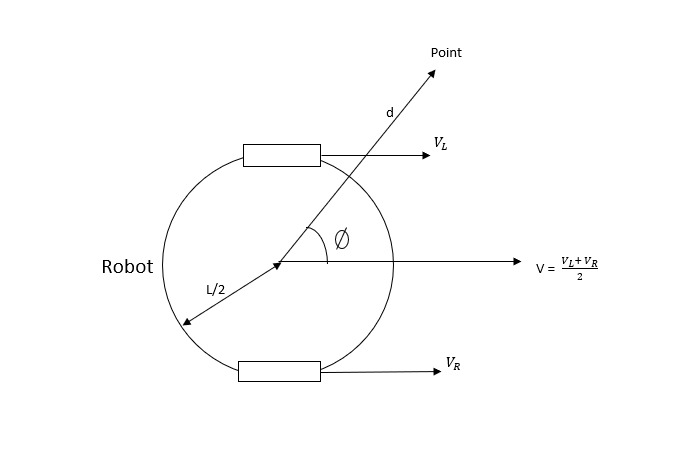
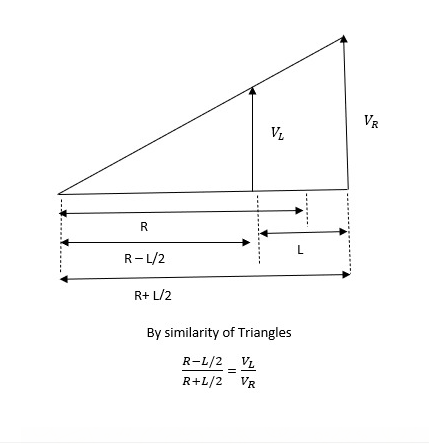

# Go Around Point
##### [Go back to main page](../../Documentation.md)
This action is implemented in the function `go_around_the_point`. Possible use cases are, for example, getting into
a appropriate position to kick the ball and obstacle avoidance.
It generates wheel velocities for robot to go around a point,assuming the robot is already on 
the circle around the point. The function takes in the radius of curvature of it's path.

## Assumptions, Inputs and Outputs
__Assumptions__: The robot is already on the circle around the point.

__Inputs__: Radius of Curvature of the path, direction: 1 = clockwise, -1 = counterclockwise.

__Output__: Robot control signal

## Logic
In differential drives the radius of curvature, the distance between wheels and the ratio of velocities of the left and the
right wheels are related. The relation is given by the following equations:

`Vl/Vr = (R - l/2)/(R + l/2)`

where R is the radius of curvature of the path and l is the distance between the two wheels.

  

Diagram showing the the Robot and the point it has to go about.

  

The figure shows the derivation of the formula using simalarity of triangles.

In this function we take the velocity of the faster wheel as 3 units, and the velocity of the slower wheel is calculated
from the ratio mentioned in the equation above.

<!---  -->
