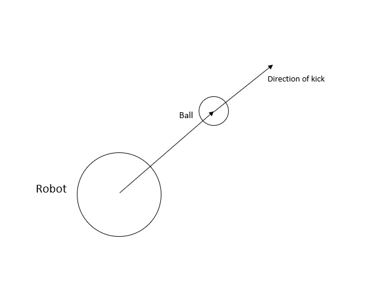

# Kick Ball
##### [Go back to main page](../../Documentation.md)

This functionality is implemented as a part of the ball model. If the ball receives a kick command from a robot, it first checks if the robot is within a predefined distance from the ball.

## Kick direction
The direction of a kick is away from the centre of the round robot. In other words, the direction of the kick is collinear with the centre of the robot and the centre of the ball.

  

__Figure 1__: Vector Diagram showing the direction of the kick and its relation to the relative direction of the ball with respect to a robot.

