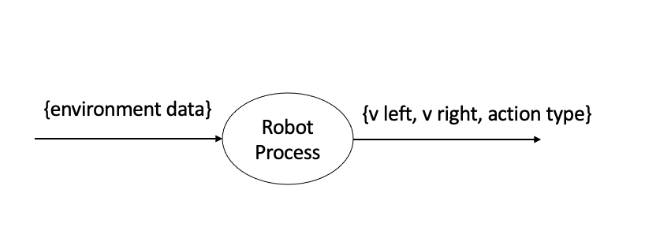

# Conclusions

With the environment complete, and the robots engineered, this project can finally be fully wrapped. The end product is a simulation of a complete football match following RoboCup guidelines and allowing the robotics field to move further in research. Both teams compete and one prevails. Team 1 demonstrates great advantage and superior strategy and decision making than Team 0. This structure of having one solid team and one testing team is needed in order to reinforce the algorithms built showing an enhancement in performance (i.e. in Team 1 with respect to Team 0). Our Expectations were mostly met due to having the team using our algorithms prevail against the testing one.

- [x] Both teams compete in a quasi-realistic match scenario and maintain interactions without any clashes.
- [x] Team 0 shows minimal effort, basic strategies and planning, no sophisticated techniques.
- [x] Team 1 demonstrates excellent performance, coordinating all team members together with the objective of scoring the most points. 

In more details, Team 1 took advantage of its built in functions that fires up the members' behavioral reactions and impuslive responses when given inputs from the environment simulator.

To sum up the pipeline of each robot:

 

      
   <figcaption>Figure 1: Process Robot Pipeline</figcaption>
   

Every prototype needs improvements, even this one. The robots rely on short-term reactions rather than long-term planning. However, to make the robots more robust and less prone to uncertainties in the environment, one can use Reinforcement Learning instead. Given a set of states for each robot, it can dictate which actions maximize its performance measure. Thus, the robot will aim on performing the actions that maximize a certain measure such as lower power utility, or scoring most points... With reinforcement learning, a carefully designed environment can certainly accomodate robots or "agents" that cope with the changes in the environment and succeed on finding the optimal actions given a certain performance measure or cost. This way, the robots can adapt to any environment in a football match such as snowing, raining, slippery paths. Moreover, they can adapt to the different rules of football such as fouls, penalties tackling and so on. Last but not least, the robots can generalize to any given environment changes once designed using Reinforcement Learning.