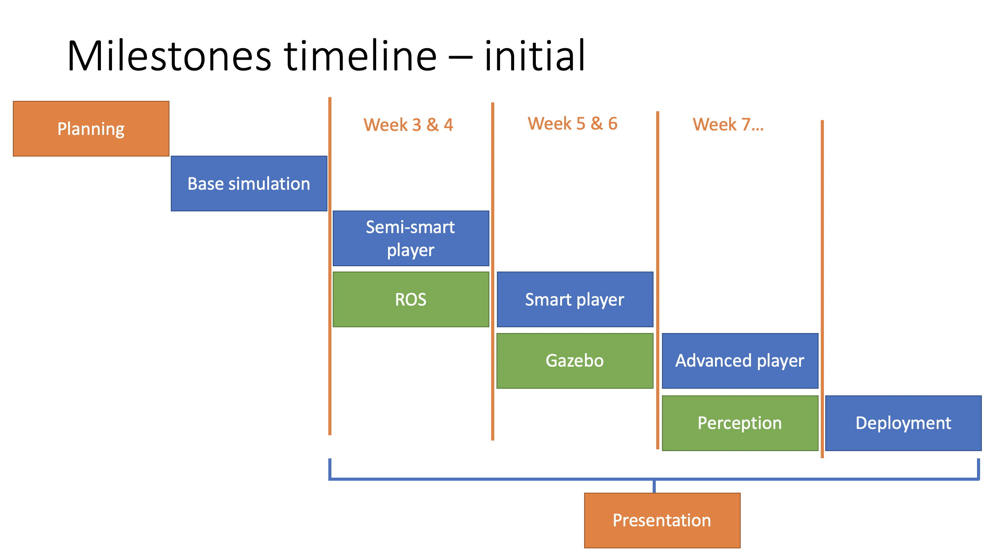
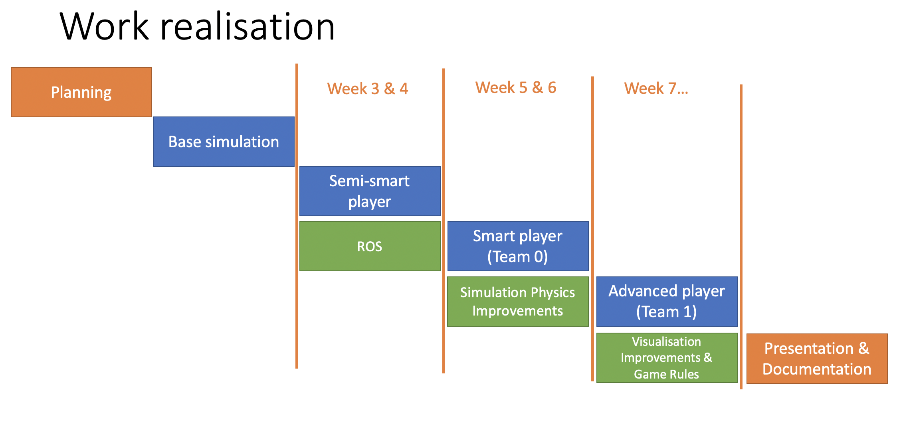

# Organisation

The majority of the documentation focuses on the technical aspects of the project.
In contrast, this part is about the organisational aspects: 
how the project was organised, how we plan the work and how the plan was modified.

This section of the documentation is split into:
1. __Project Organisation__ - is about how the project was planned and how it was executed. 
   It also mentions the resources used to achieve the final product.
2. __Team Organisation__ - elaborates on the team structure and internal work culture 
   (including the responsibilities, communication, reporting and knowledge exchange).
3. __Area of Improvements__ - presents our reflections on what could be improved in the project

## Project Organisation

From the very beginning of the project, we were encouraged to follow a "commercial" approach to organise the work. 
It included defining the product, estimating the resources, designing a development plan and preparing the product release/presentation. In the next few paragraphs, we will focus on the non-technical aspects of the development process. 

### Resources estimation

After the project description was provided, we estimated the team capabilities and external resources we can access during the project.

The main identified resources, capabilities and their costs are presented in Table 1.

| Resource      | Capabilities | Cost | 
| ----------- | ----------- | ----------- |
|  @[Szymon](https://github.com/szgula) - __120h__     | C++, Python,...       | £100 |
| @[Feng](https://github.com/fengfengFinn) - __120h__  | Visualisations, PyGames...        |£100|
| @[Omar](https://github.com/OmarJabri7) - __120h__    | ROS, ....        |£100|
| @[Yifan](https://github.com/Yifan-Xie) - __120h__    | ...        |£100|
| @[Shrey](https://github.com/shreyExp) - __120h__     | ...        |£100|
| @[UofG]() University Staff Support - __on demand__ (estimated 16h)    | Advisors (design, organisation, coding, etc.)       |£1000|
__Table 1__: Project available resources.

### Plan
Based on the estimated resources, we defined the project technical milestones needed for planning. 
At that point, the mentioned milestones were not limited to realisable in a given time frame but only limited by the available team's skill-set and capabilities.

Next, we decided to work in a small release framework (like Scrum framework), with regular releases of the growing product.
The key feature of this approach (in comparison to the proposed waterfall framework) is that from the early stage of development, our product was usable (although limited in functionality).
Following this methodology, the simplified time plan was created based on the previously defined milestones. 
It is worth noting that after the initial minimum value package (base simulation), the work was split into two streams, each extending functionality in different directions (blue blocks - functional, green block - infrastructural).
In Figure 1 we present the milestones chain with the estimated finish time.

__Figure 1:__ Milestones time plan including functional components (blue), infrastructure (green) and other (orange).

#### Risks
During the planning process, we identified a few risks to the project, including organisational and technical ones:
1. Technical:
    - High entry-level to ROS
    - Unstable simulation
    - Gazebo integration issues
    - Getting stack with strategy development
2. Organisational:
    - Absence of a team member
    - Lack of unanimity in decision-making
    - Lack of leadership
    - Unsatisfying management
    
### Actual Work

During the project realisation, we slightly adjusted the plan to overcome discovered blockers and adapt for changing priorities. 
It can especially be seen in the infrastructure milestones, where the Gazebo Simulation and Perception blocks were replaced by extended work on our own simulator.
Thanks to the initial work organisation and development flexibilities, these changes were very simple to accommodate and did not influence any other project dependencies.

__Figure 2:__ Components realisation: functional components (blue), infrastructure (green) and other (orange).

Also, it needs to be pointed out that some identified risks came true,
for example issues with Gazebo integration and reduced involvement of a single stakeholder.  

#### Used Resources - Human Resources 
In total, the team has spent about 480 hours over the semester on this project (value for April 17th). 

| Resource      | Estimate | Time sum(period) = total | 
| ----------- | ----------- | ----------- |
| @[Szymon](https://github.com/szgula)    |120h | 20+24 + 18 + 34 + 15 = __111h__     |
| @[Feng](https://github.com/fengfengFinn)  |120h | 10+22 + 18 + 30 + 12 = __92h__        |
| @[Omar](https://github.com/OmarJabri7) | 120h    |  12+24 + 28 + 34 + 13 = __111h__        |
| @[Yifan](https://github.com/Yifan-Xie) |120h    | 10+22+19+30+13 = __94h__        |
| @[Shrey](https://github.com/shreyExp) | 120h     | 11 + 19 + 16 + 15 + 12 = __73h__        |
| @[UofG]() University Staff Support - Dr. McGookin   | on demand (estimated 16h)     | __9h__|

__Table 2__: Project work time summary.

Cumulative project cost: 480h * £100 + 9h * £100 = __£57,000__.

In comparison, the estimated project cost was __£80,000__.

#### Used Resources - Tooling

Over the project we used multiple open-source and permissive free software:
- PyCharm Community - the IDE to develop the code,
- ROS (Robot Operating System) - the framework to design concurrent software widely used in robotics and simulation applications,
- Python - the programming language used for software development,
- Gazebo - physics simulation used at the prototyping stage,
- Several python libraries.

The mentioned technology stack and tools enabled us to focus on the project-specific problems and avoiding spending time on the 
development infrastructure, designing communication protocols or low-level functionalities.

## Team Organisation

Knowing that even the best plan will fail without the team who can realise it, this section focuses on the team organisation. First, we briefly discuss the initial responsibilities and how they evolved over time.
Next, we move to the work culture to elaborate on communication, reporting and knowledge exchange.

### Responsibilities
After the project scope definition, we decided to split the responsibilities with respect to the technical needs and members capabilities.

This management plan seemed to work poorly in the newly formed team that worked fully remotely in different time zones (due to the Covid-19 pandemic). 
Over time, this structure converges to the more sparse technical responsibilities and well-defined leadership.

| Resource      | Initial Responsibility | Main project contribution area | 
| ----------- | ----------- | ----------- |
| @[Szymon](https://github.com/szgula)    |External communication, non-technical documentation |  Leadership, organisation, development infrastructure, simulation     |
| @[Feng](https://github.com/fengfengFinn)  |Integration, deployment | Visualisations, system control, tactics    |
| @[Omar](https://github.com/OmarJabri7) | Testing, verification    |  System design, strategy development, ROS       |
| @[Yifan](https://github.com/Yifan-Xie) |System design    | Strategy development, tactics, system control       |
| @[Shrey](https://github.com/shreyExp) | Requirements, technical documentation     | Control       |
| @[UofG]() University Staff Support - Dr. McGookin   | Supervision    | Supervision |

__Table 2__: Project responsibilities.

### Work Culture
#### Communication
The key to team success is excellent communication. 
Due to the pandemic, we had to work fully remotely with previously unknown teammates. Hence, it was especially important to have a well-organised information flow.

We decided to have two internal meetings every week and one with the university supervisor.
During the internal meetings, we run short-term planning, presented the developed software and brainstorm new ideas. 
The meeting with the supervisor was in the form of the client meeting, where we presented the achievements, reported the billing (team time allocation), presented future work and reported development risks. 

In addition to the regular meetings, we organised many ad-hoc meetings for the whole team or in sub-groups.

#### Knowledge exchange
In addition to the scheduled meetings, we conducted some internal training and tutorials about specific tools and frameworks.
Also, we put extra effort to document the work to enable easy access to the information, including code documentation (mostly in docstrings), presentations with work status, video clips showing the system performance and a fine organised version control repository. 
