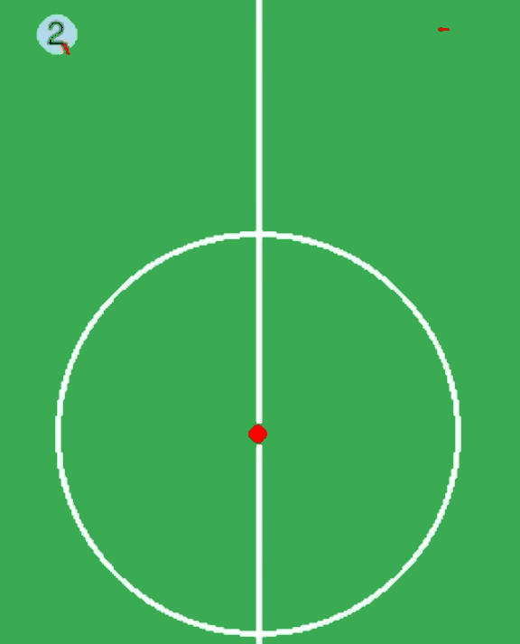

# Result Analysis

##### [Go back to main page](../Documentation.md)

## Test Cases
1. Go to position  

|  Steps   | Expect Result  | Result |
|  ----  | ----  | ----  | 
|  Set a target point and let player from a random position to start moving | The player go straight to the target point |Pass 
  <b>Figure 3: Gif of go to point testing</b>

2. Go around position  

|  Steps   | Expect Result  | Result |
|  ----  | ----  | ----  | 
|  Set a target point and let player from a random position to start moving | The player will go around the target point until find the best angle towards opponent gate |Pass 
  <b>Figure 3: Gif of go to point testing</b>

3. Dribble 

|  Steps   | Expect Result  | Result |
|  ----  | ----  | ----  | 
|  Set the ball to a random position and let player from a random position to start moving | The player will dribble the ball to the opponent gate direction |Pass 
  <b>Figure 3: Gif of dribble testing</b>

