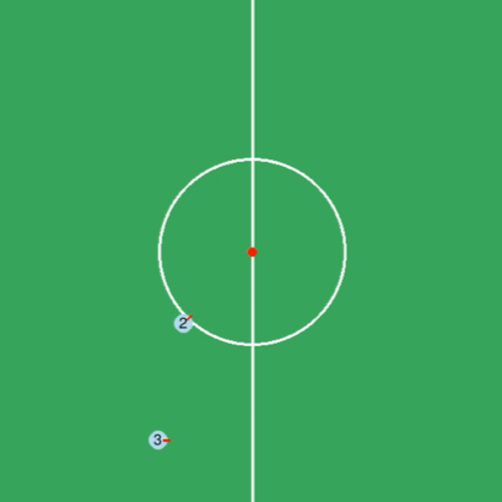
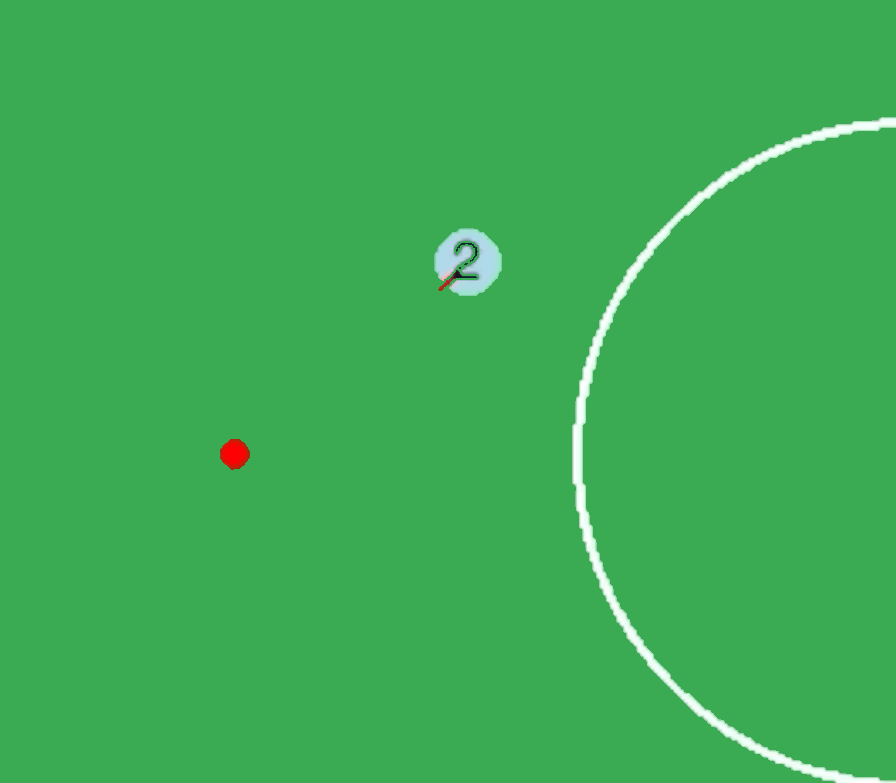
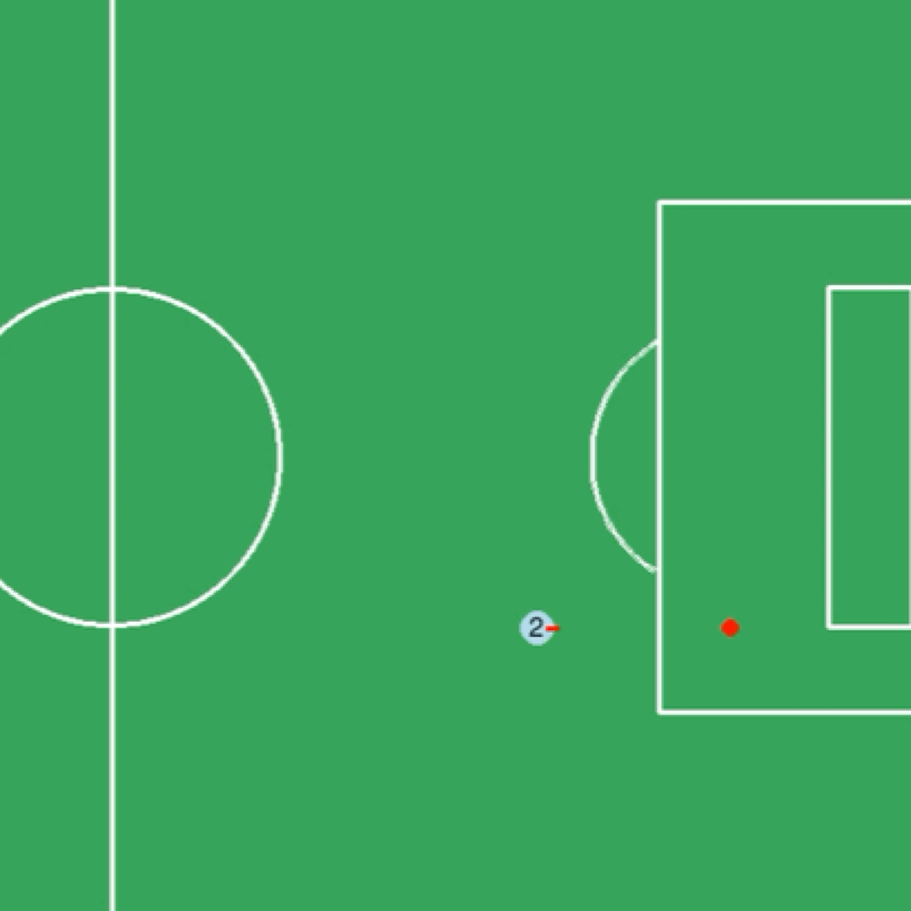
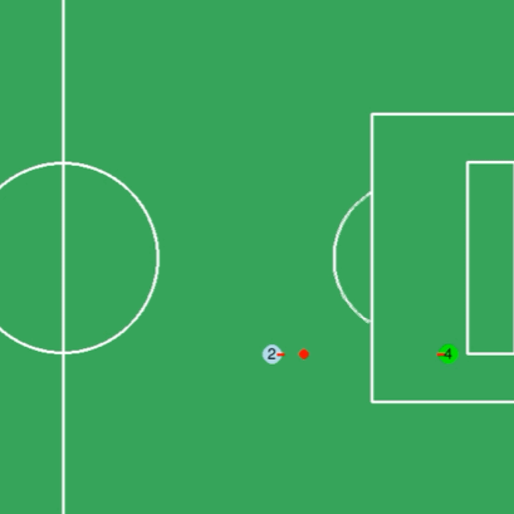
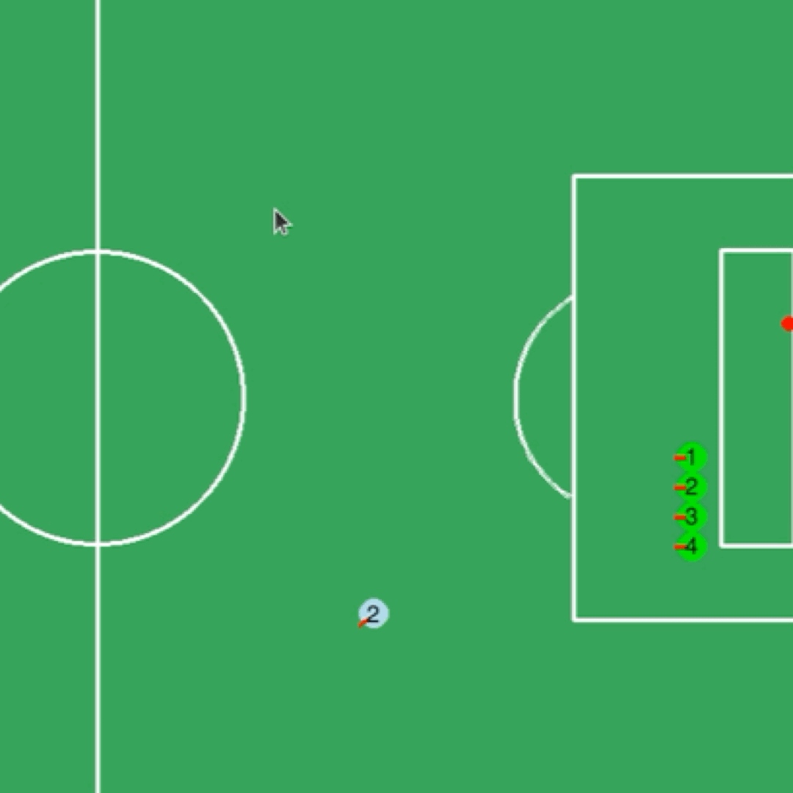
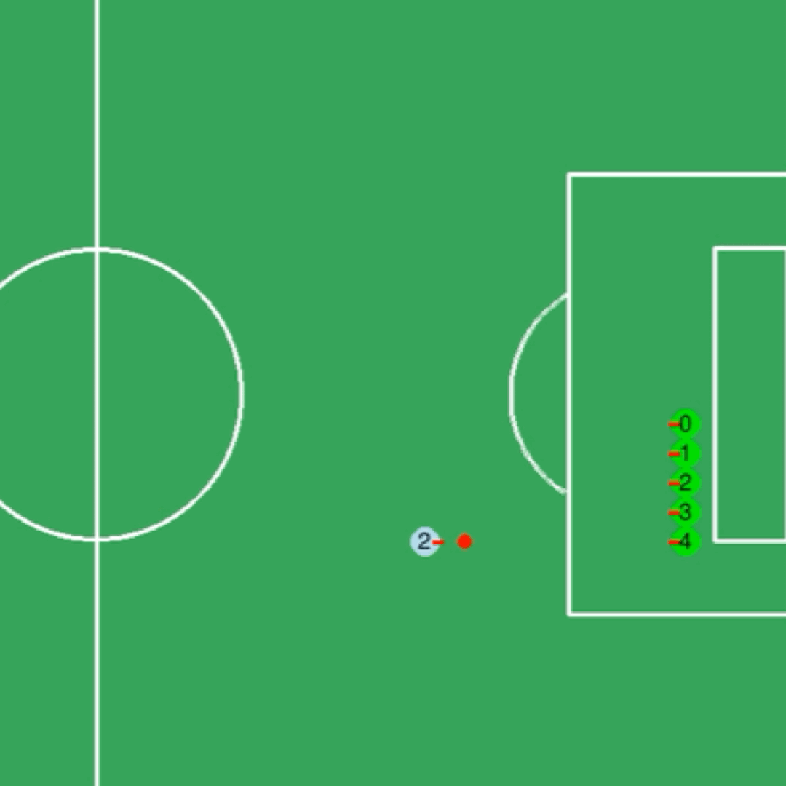
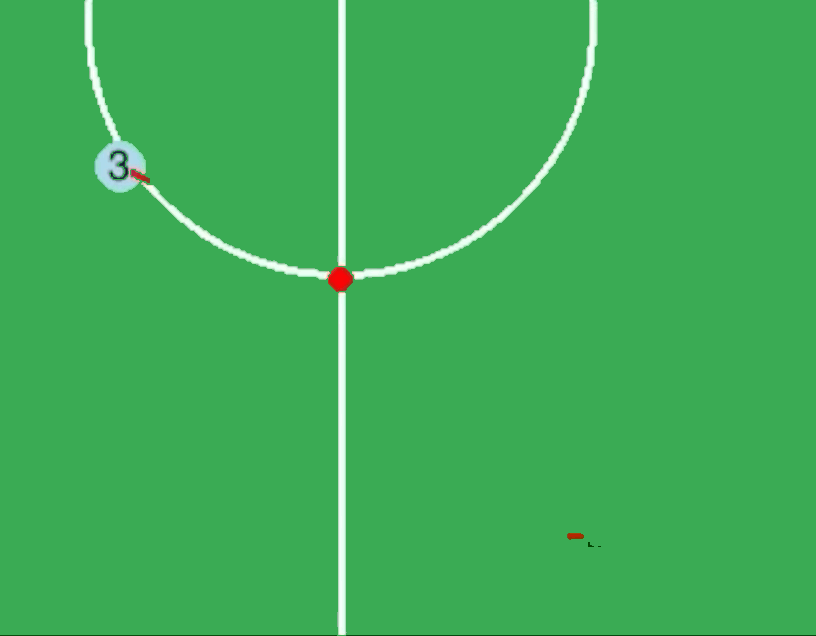
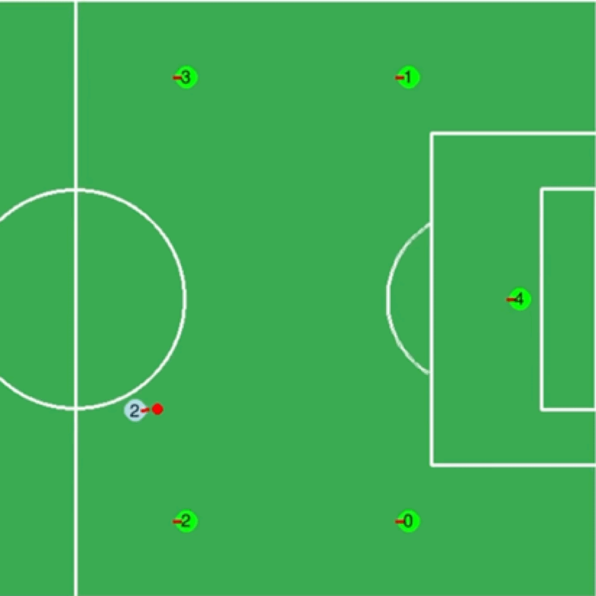
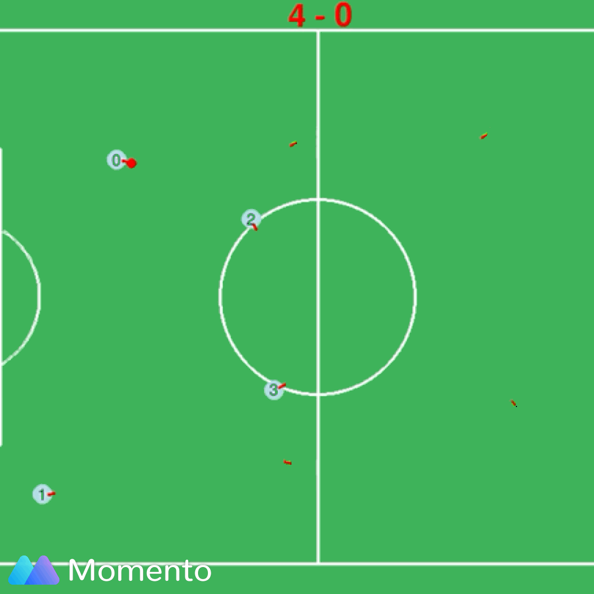
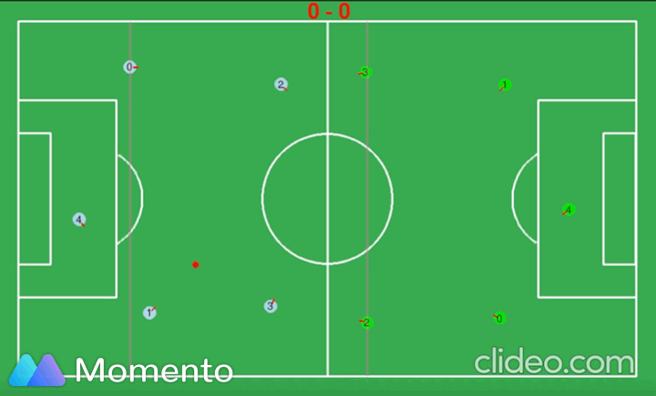

# Result Analysis

##### [Go back to main page](../Documentation.md)

## Test Cases
- Go to point  

||  Steps   | Expect Result  | Result |
| ----  |   ----  | ----  | ----  | 
|1|  Set a target point and let player from a random position to start moving | The player go straight to the target point |Pass 
  figure : go to point test

- Go around point  

||  Steps   | Expect Result  | Result |
| ----  |   ----  | ----  | ----  | 
|1|  Set a target point and let player from a random position to start moving | The player will go around the target point until find the best angle towards opponent gate |Pass 
  figure : go around point test

- Kick ball  

||  Steps   | Expect Result  | Result |
| ----  |   ----  | ----  | ----  | 
|1|  Set player to a random position and no enemy in the way. Let player to kick the ball| The player will find a appropriate angle and shoot|Pass 
  figure : test kick

|2|  Set player to a random position and one enemy in the way. Let player to kick the ball | The player will find a appropriate angle and shoot |Pass. And the shoot angle become larger
  figure  : test kick with one enemy

|3|  Set player to a random position and four enemy in the way. Let player to kick the ball | The player will find a appropriate angle and shoot |Pass. And the shoot angle become larger 
  figure : test kick with four enemy

|4| Set player to a random position and five enemy in the way, which give no space and chance to let the player kick the ball | The player will just dribble the ball or wait other team member |Pass 
  figure: test kick with five enemy

- Dribble 

||  Steps   | Expect Result  | Result |
| ----  |   ----  | ----  | ----  | 
|1|  Set the ball to a random position and let player from a random position to start moving | The player will dribble the ball to the opponent gate direction |Pass 
  figuredribble test

|2|  Set player in upper or lower field | The player will dribble the ball along corresponding path  to the gate|Pass 
  figure :dribble from different direction

- Avoid Obstacle

||  Steps   | Expect Result  | Result |
| ----  |   ----  | ----  | ----  | 
|1|  Run a demo match. Put players closed or make players to persue one ball. Observe whether players will get stuck with each other | Players have the ability to avoid obstacle|Pass. If get stuck, player can redirect itself
  figure : avoid obstacle between two players test

- Pass Ball & Go To strategy position

||  Steps   | Expect Result  | Result |
| ----  |   ----  | ----  | ----  | 
|1|  Run a demo match. Put players randomly. Set virtual enemies to force players to pass ball. |N/A|N/A| 
|2|  Keep observe whether the pass ball action work normally. If not, you also can change the initial positions  | The action of passing ball work normally and the corresponding team member could also go to the strategy position automatically |Pass
  figure : avoid obstacle between two players test

- Offside warning line

||  Steps   | Expect Result  | Result |
| ----  |   ----  | ----  | ----  | 
|1|  Run a demo match. Players start from opening positions|N/A|N/A| 
|2|  Keep checking whether the line could indicate the offside position. Whether the line is pink.  | The color of warning line is pink. The line could indicate the possible offside position x. |Pass. Both warning line works well
  figure : avoid obstacle between two players test
