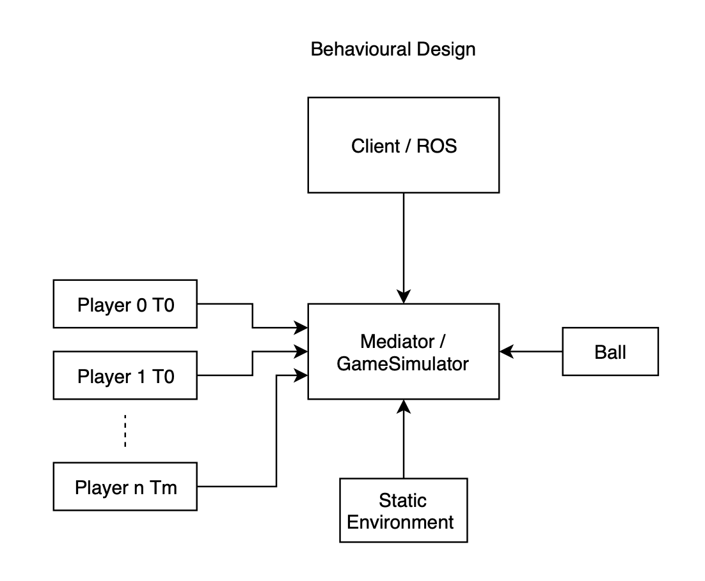
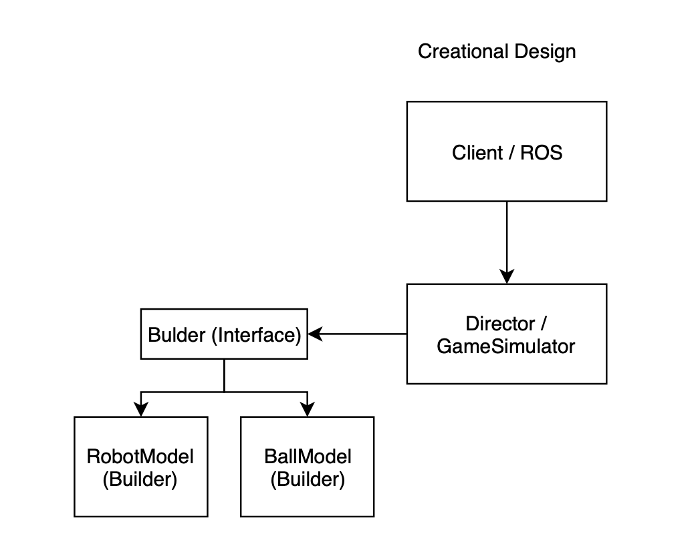

# Simulation 
##### [Go back to main page](../../Documentation.md)

__Missing!__ general description on the simulator

# Architecture
The game simulator was developed following two design patterns: 
* __Mediator__ (behavioural design pattern) - used to communicate all simulation components and provide an information flow
* __Builder__ (creational design pattern) - used to initialize all simulation components
  
Such architecture enabled fast development, provide easy to use interfaces and allow flexibility to reuse
existing code.


__Figure 1:__ Simulation module design from behavioural perspective

__Figure 2:__ Simulation module design from creational perspective

# Components
The game simulation was split into the following components:
1. ```game_simulator.py``` - wrapper for the game simulation  
2. ```ball_model.py``` - the physic model of the ball 
3. ```robot_model.py``` - the physic model of the robot/player

## 1. GameSimulation
The ```class GameSimulation``` is responsible for three main functionalities. 

First, it initializes the game field with modelled objects - a ball and robots which represents the players. 
Thanks to the Builder design pattern used to develop this class, the simulation reconfiguration is very easy 
(replacing the physics models, changing a number of players, size of the field etc.). 

Another class responsibility is to handle calling time updates for each object in the simulation and detect possible collisions and interactions between objects. 

Finally, this module represents the static environment of the game field (goal nets, field frame).

### Coordinate system
The project uses two main coordinate systems (CS): the world coordinate system (wcs) and the ego-field coordinate system (efcs). 
Both CS have origin in the middle of the field. The X-axis of wcs is oriented towards the right net, the Y-axis and angles are defined according to the right-hand rule.
The efcs are defined for each team separately. The difference between wcs is in X-axis orientation, which is towards the opponent's net.

### External interface
__Initialization:__

```GSS = GameSimulator()```

Available options:
```
number_of_teams: int = 2, 
number_of_robots: int = 5,
size_of_field: tuple = (10, 6), 
dt: float = 0.1,
team_0_starting_points: list = None,  # Default positions are predefined for each role
team_1_starting_points: list = None,
ball_init_pos: tuple = None,  # default (0, 0)
ball_init_vel: tuple = None   # default (0, 0)
```

__Simulation time update__

```update_status, goal_status = GSS.step(teams_commands)```

Where ```teams_commands``` is a set of actions to control the players

__Interface for the visualization__

```self.get_positions_for_visualizer())```

## 2. Models
The ```class BallModel``` and ```class RobotModel``` are objects which are used to create a dynamics part of the simulation. All models use the shared interface to initialize objects, 
perform the time update and react to the external actions (if available for the object).

### Ball

The ball is modelled as a rigid body with a point mass attached in the centre. The main force acting on the object is a friction force proportional to the object velocity.
Other forces which act on the ball are collision forces (with players or walls), kick forces and receive forces. 
The collision forces are simulated as elastic collisions with energy lost. 
The kick and receive actions acts on the ball to compensate the ball velocity (receive) or add extra velocity outwards the player (kick).

### Robot

Robots are modelled as a two wheels differential drive platform with a cylindrical shape. 
For the model, just kinematics is implemented (no dynamics) - this is under the assumption that motors are overpowered and there is no wheel skid.
Except for the wheel speed control, each robot has two additional actions: kicking and receiving the ball which only works if the ball is within the robot's contact range.


__Figure 3:__ Differential drive model (Hameed, 2009)


