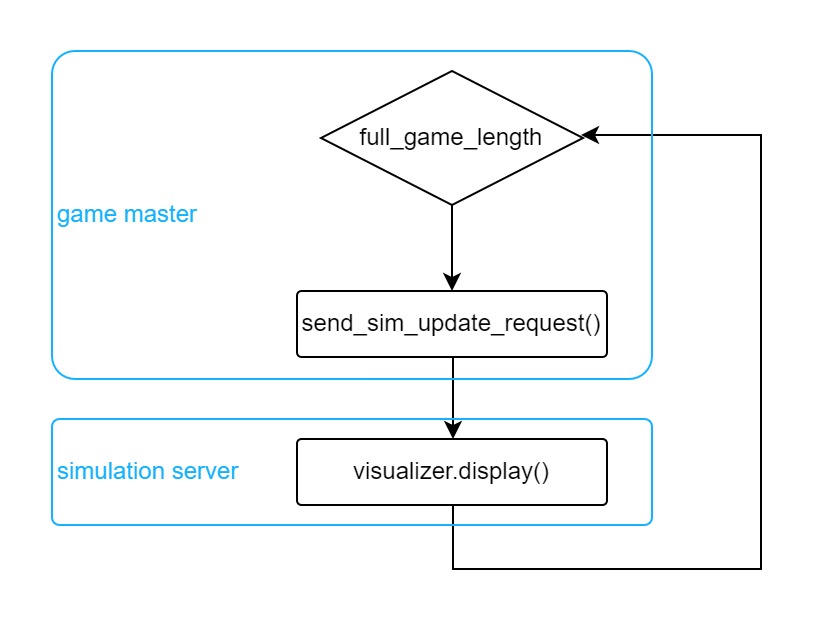
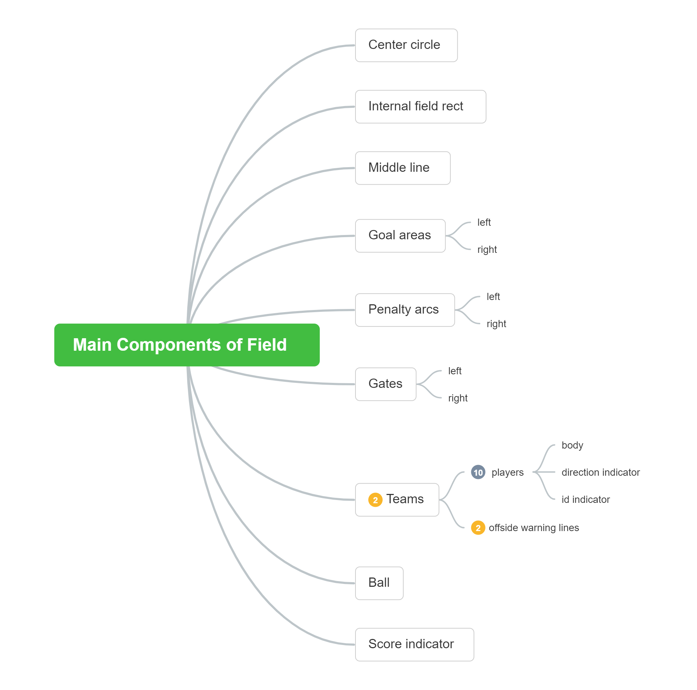
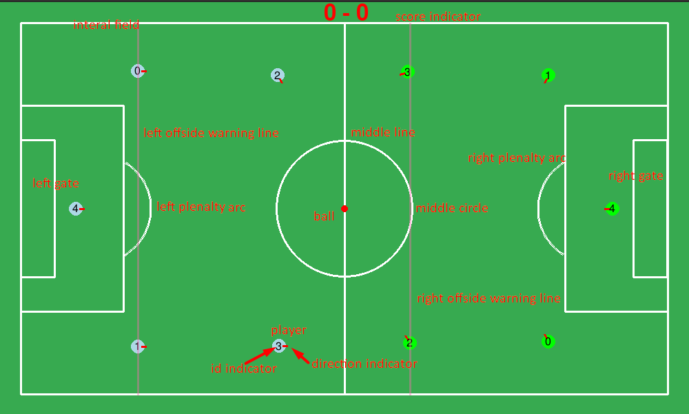

# Visualization

##### [Go back to main page](../../Documentation.md)

# Architecture

The game visualizer is embedded in the `GameSimulationServer` as a utility class. `visualizer.py` contains all the functional code for visualization and there is only one relevant class just to call this function when necessary.

Such architecture bring all logic about visualization together and that make simulator no longer need to worry about display and just need to focuses on the physics engine, which make the whole project keeps the low coupling and high cohesion virtue.

## Workflow

Once game start, the game master will start a loop first, the length of which depends on the value of `full_game_length`.

In each interation, the master will not only request `team0_server` and `team1_server` for latest command for every player but also send request to `simulator_server` for updating all the visualizaion display.

```
rospy.Service(r'game_engine/game_simulation', SimulationUpdate, self.handle_simulation_call)
```

  
**Figure 1:** Visualizer Workflow

## Display components

Visualizer is responsible for almost 9 components' displaying:

1. **id indicator**: show the number of every player
2. **direction indicator**: show the direction every player points to and will change in real time.
3. **offside warning line**: just display the possible offside line for warning purpose


**Figure 2:** Components for visualization


**Figure 3:** Components for visualization marked on map

## Available properties for setting display style

we can use these properties to set the style for every components.

```
self._robo_radius = 10
self._ball_radius = 5
self._field_line_color = (255, 255, 255)
self._offside_line_color = (255, 105, 180, 100)
self._field_color = (55, 170, 80, 0)
self._robo_dirc_color = (255, 0, 0)
self._field_line_width = 3
self._center_circle_radius = 1 * display_scale
self._goal_area_width = 1.5 * display_scale
self._goal_area_height = 3 * display_scale
self._penalty_arc_area_radius = 0.8 * display_scale
self._penalty_arc_center_distance = 1.1 * display_scale
self._margin = 0.3 * display_scale
self._gate_height = 2 * display_scale
self._gate_color = (170, 170, 170)

```
