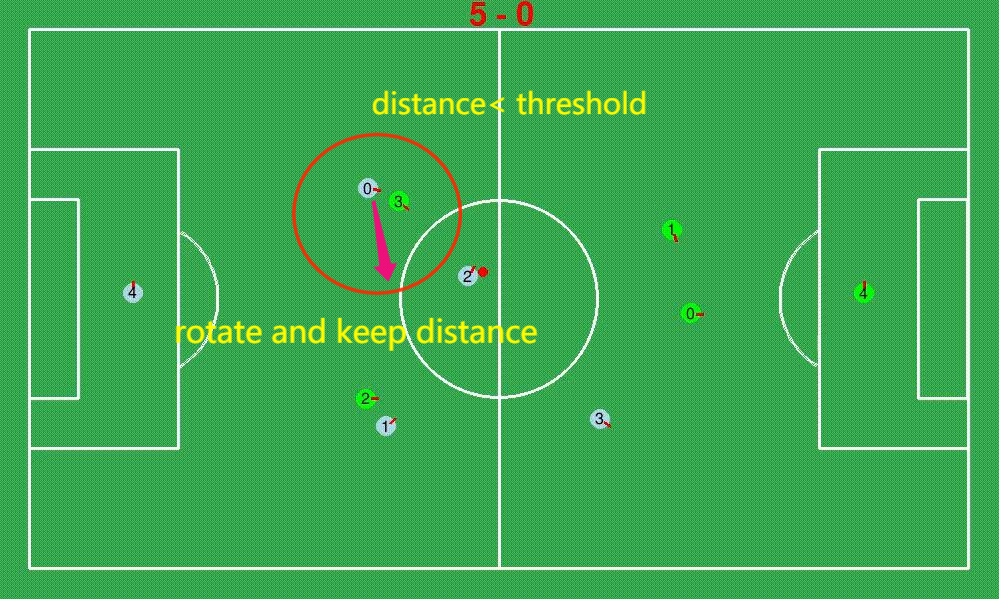
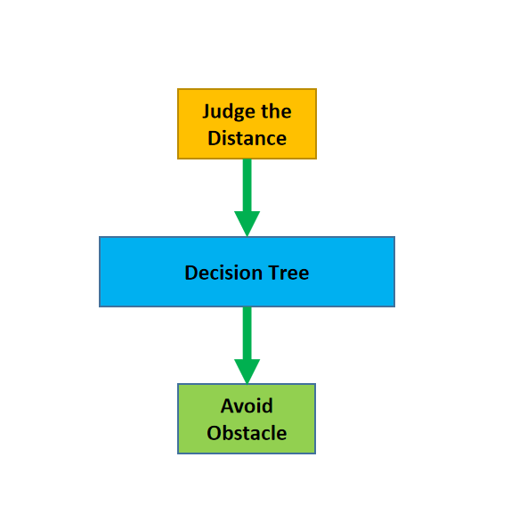
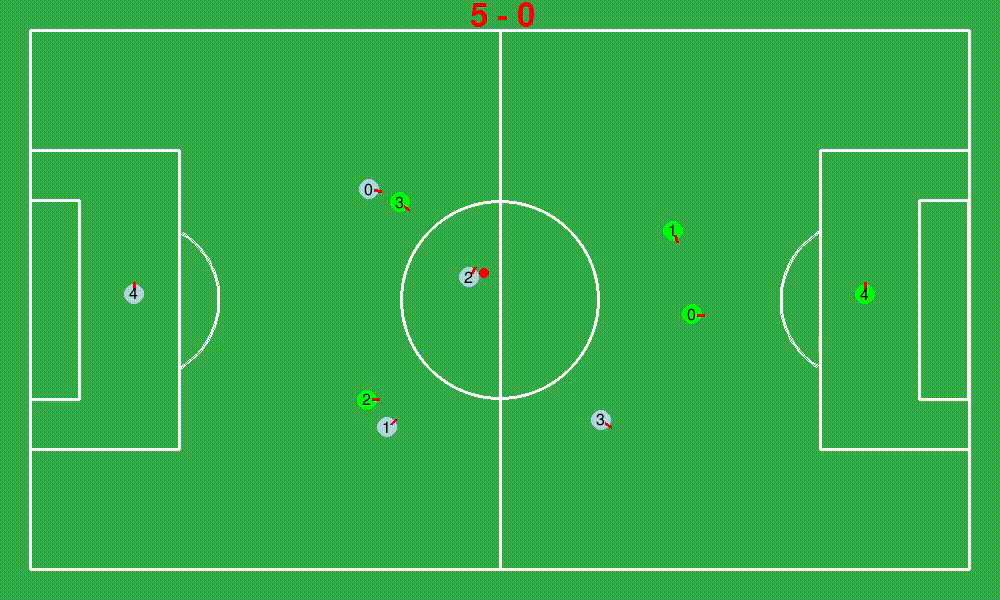
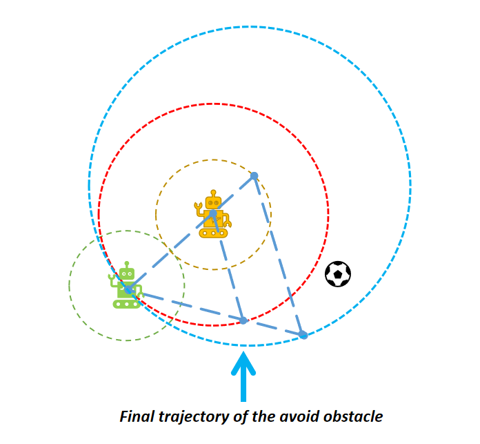

# **Actions**

**[Go back to main page](../../Documentation.md)**

## Avoid Obstacle

Avoiding obstacle function ensures that robots do not collide with each other. 
For example, when robots from the opponent team move along trajectories that cross or get closer to our robot, our robot should correct its trajectory to avoid obstacle.  

The obstacle avoidance needs to consider two main scenarios:
- Situations that involve short and high priority actions (i.e., pass the ball) 
  when a robot should minimise the risk of losing an initiative in a short time at the cost of a future unfavourable position.
- Cases when a robot executes long actions that do not contain short term behavioural twists (example presented in Figure 1).

<p align="center">
   <br><br>
</p>

__Figure 1__: Visualisation of avoiding obstacle function.

The information flow for the avoid obstacles function is presented in Figure 2.

<p align="center">
   <br><br>
</p>

__Figure 2__: The information flow of avoiding obstacle function


  
### Avoid obstacles methods

Avoid obstacles logic is split into multiple stages of which execution (if and to what extent) is dependent on a player's specific situation.

#### First stage: Go back

The simplest way to avoid obstacles is to roll back the player. 
This method is especially useful when a robot is close to the field edges, however, it has many constraints and limited strategic applications.
        
#### Second stage: Rotate away from the obstacle

The second method focuses on avoiding obstacles based on the assumption that an obstacle is stationary.
It is realised by rotating the robot away from obstacles that are ahead. This method works fine in cases the obstacle is stationary or moves away from the collision point.
However, due to undertaken assumption, it fails to execute if an obstacle is moving in the direction of the robot's rotation. 
To overcome this, the algorithm changes the direction of rotation if the previous stage fails to execute over a predefined period of time.
Although it does not cover all scenarios, we found it works sufficiently well in games.

In figure 3, we can see the **No. 0** robot in the **Team 0**(blue team) avoids obstacle using the discussed method.

   <p align="center">
      <br><br>
   </p>

__Figure 3__: Visualisation of avoiding obstacle function.


#### Final stage: Keep distance

This stage ensures that robot does not return to a place where avoiding the obstacle is necessary. 
It "pulls away" a robot from the obstacles (like potential field method).
<p align="center">
   <br><br>
</p>

__Figure 4__: Visualisation of keep the distance method.

### Implementation

The above described methods are implemented under following static methods:

```python
# The function is to judge the distance between the robot and obstacles (Teammates, opponents, ball).
def distance_judge(game_info: list, init_distance = None) -> [bool, int, int]

# When the flag of the above function is true, we can get the team id and player id from distance_judge() function and put them here so that the robot can do avoid_obstacle().
def avoid_obstacle(game_info: list, team_id, obstacle_player_id) -> PlayerCommand
```
