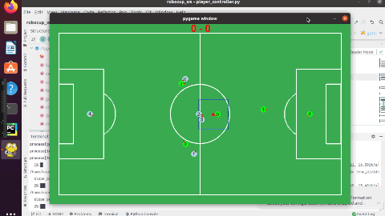

# **Actions**

 **[Go back to main page](../../Documentation.md)**

 ## Cover Opponent

 Football is all about strategy. Having a good defensive mechanism is one of the most important aspects of the game. 
 A defender should always keep an eye on any close opponents that might be/are in the team's field position.
  This algorithm has been developed to mimic the actions that a real player might perform.
  The robots assigned to "Defence" mode gather numerous information from the simulator in order to dictate what action they should take next.

 ## How does Cover Opponent work?

 The defender has the following inputs from the environment:
   1- Ball position at any given time t.
   2- All opponents positions at any given time t.
   3- Dangerous opponents tha are close to their part of the field.
   4- Based on (3), defenders locate the two closest players to their part of the field and act upon that information.
   5- Defenders also extract the ball's position to dictate if the ball is in their field or not.

 Given this valuable information, all players in "DEFENCE" mode have all they need to prohibit any scoring from the opposite team.
  Consider the following example: 
  One opponent Opp0 has the ball and is approaching the dangerous zone of the defenders. 
 Alongside two other opponents Opp2 and Opp3 closer to the goal post and good pass candidates. 
 The two defenders Def1 and Def0 will setup a front against them. This scenario can be presented by Figure 1:

  

       
    <figcaption>Figure 1: Cover Algorithm Example 1</figcaption>
    

 Its is quite clear how given dangerous opponents (i.e. Opp2 and Opp3), the two defenders locate the best points to approach next to the opponents in order to intercept a probable pass.
  The red circles demonstrate the area that defenders will advance to when the opponent players are within the dangerous zone (i.e. close to the goal post).
  Moreover, they will orient their heading angles towards the ball's position to prepare for interception (if the distance between them and their assigned opponent is bigger than a certain threshold), as represented by the blue dotted line.
  How do these players cover the dangerous pass candidates? By performing the following functions  pipeline:

 1. `ball_in_zone`: The defenders will always extract the ball's position repeatedly. If the ball is in their zone (i.e. in their half), they will go to any point under the circle area.
 2. `go_to_ball_special`: This function is special, as its name dictates. It is a priority for the defenders to intercept/catch the ball when it is in their zone. 
    Hence, the closest player to the ball calculated using euclidian distance will aggressively approach the ball to get back their possession points.
 3. `get_covered_opponent`: If the ball is with the opponents, the defenders will try their best to cover all pass candidates (e.g. two opponents in Figure 1). 
    They do the latter by locating the closest players to the net and closest to them and extract their coordinates.
 4. `cover`: Given the coordinates from (3), the defenders will approach the opponents at a given distance and keep following the opponents for better protection.

 Another scenario might be where only one opponent is approaching the goal post presented by Figure 2:

  

       
    <figcaption>Figure 2: Cover Algorithm Example 2</figcaption>
    

 In this instance, Def0 will approach Opp3 (red circle) while keeping a distance, whilst Def1 will hold the fort and wait for any other dangerous opponents (black square).

 A detailed presentation of the cover mechanism is illustrated by the following GIF:

  

       
    <figcaption>Figure 3: Cover Scenario</figcaption>
    

 As demonstrated by Figure 3, the defenders accomplish their given tasks and sucessfully prohibit the defenders from scoring any points or even approach the goal post.

 ## Shortcomings and future improvements:

 Even with this success, the solution can use some tweaking. An important improvement would be to allow the defenders to estimate where the ball would be in order to start approaching it before hand and enhance the chance of interceptions. 
 Another aggressive enhancement would be to allow the defenders to deflect the opponets' paths by "shoulder pushing" them out of their desired positions and gain coverage and further increase the possibilities of an interception.
