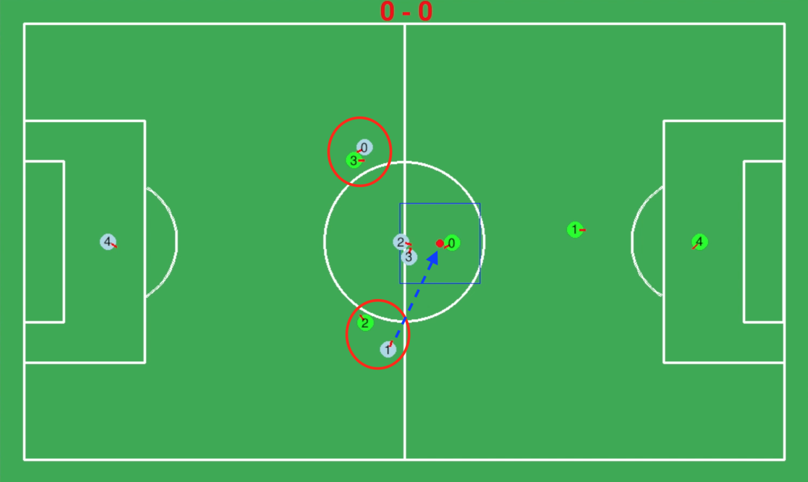
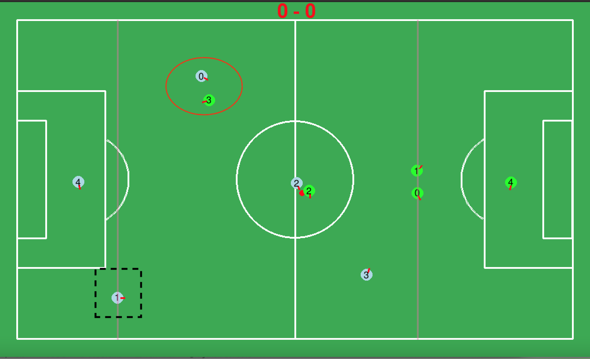
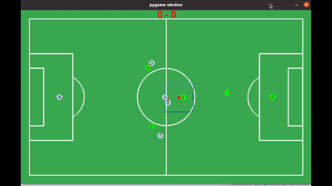

dfp 
# **Actions**

 **[Go back to main page](../../Documentation.md)**

 ## Cover Opponent

A defender should always keep an eye on any close opponents that might be in the team's field position.
This algorithm has been developed for robots in "Defence" mode to mimic the actions that a real player performs to cover an opponent.

 ## Cover Opponent

The defender takes the following inputs from the environment:
1. Ball position
2. All opponents positions
3. List of opponents classified as "Dangerous"

Given this information, all players in "DEFENCE" mode can undertake actions to prevent the opposite team from scoring the goal.

Consider the example presented in Figure 1: 
One opponent Opp0 has the ball and is approaching the danger zone of the defenders. 
Meanwhile, the two other opponents (Opp2 and Opp3) are closer to the net and are good candidates to pass the ball to. 
The two defenders (Def1 and Def0) will form a defence line.

     

__Figure 1__: Cover Algorithm Example 1

Given the two dangerous opponents (i.e., Opp2 and Opp3), the two defenders locate the best positions to interupt a possible pass.
The red circles demonstrate the area that defenders will advance to when the opponent players are within the dangerous zone (i.e., close to the goal post).
Moreover, they will orient their heading angles towards the ball's position to prepare for interception (if the distance between them and their assigned opponent is bigger than a predefined threshold), as shown with the blue dotted line.

The algorithm steps to cover "dangerous" opponent are the following:

 1. `ball_in_zone` - the defenders will constantly extract the ball's position. If the ball is in their zone (i.e., in their half), they will go to any point under the circle area.
 2. `go_to_ball_special` - priority function for the defenders to intercept/catch the ball when it is in their zone. 
    Hence, the player closest to the ball (calculated using euclidian distance) will aggressively approach the ball to get back its possession point.
 3. `get_covered_opponent` - used if the ball is close to opponents, the defenders will try to cover possible pass trajectories (e.g., two opponents in Figure 1). 
    They do the latter by locating the closest players to the net and the closest to them and extracting their coordinates.
 4. `cover` - given the coordinates from (3), the defenders will approach the opponents at a given distance and keep following the opponents for better protection.

Another scenario might be where only one opponent is approaching the goal post, like presented in Figure 2:

  

       
    

__Figure 2__: Cover Algorithm Example 2

In this instance, Def0 will approach Opp3 (red circle) while keeping a distance, while Def1 will hold the position and wait for any other dangerous opponents (black square).

A working example of the cover mechanism is illustrated in Figure 3:

   

__Figure 3__: Cover Scenario

As demonstrated in Figure 3, the defenders accomplish their given tasks and successfully prevent the defenders from scoring a goal or even approaching the strategic positions.
