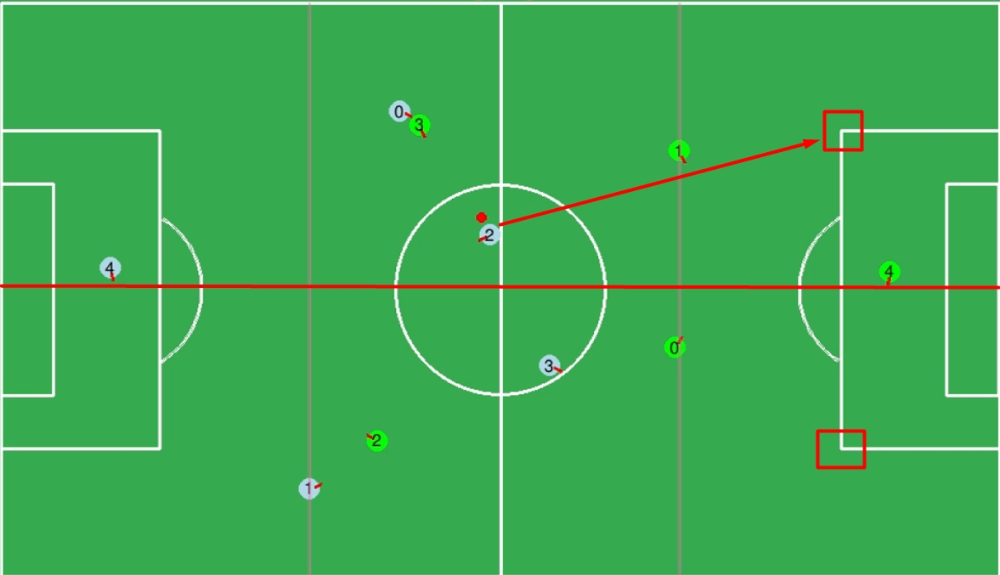
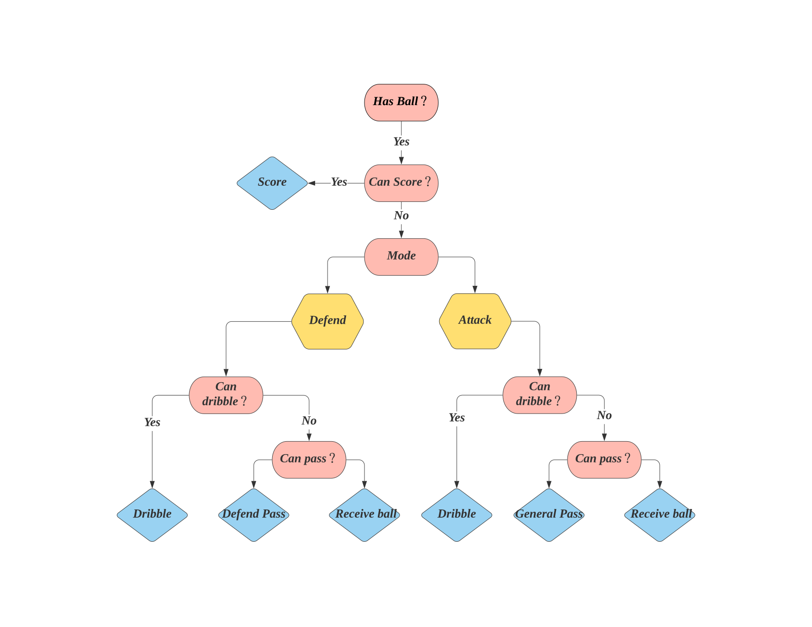

# **Actions**

**[Go back to main page](../../Documentation.md)**

## Dribble Ball

Dribbling ball is an advanced action for our robotc. With this action, the robot could carry the ball towards the opponent net.
This action is formed by two basic actions which is receiving ball and going to point. For scoring in the soccer competition, robots need to carry the ball to hte
goal net as closer as possible.

### How the Dribbling ball action works?

When the player want to dribble the ball. The first thing need to consider is to control the speed of the ball, so we will use receive_ball method to sychronize the ball speed with player.

Then the player need to find a appropriate angle towards the opponent gate. In order to reach this position where could let player convenient to push the ball, we use go_around method to let the player rotate the ball until reach that position.

Finally, we select two goal point where locate in the the two corners of the goal area. When players in the upper half of the field, they will choose the upper one and vice versa.

   

   
### Where to place this action in desition tree?

  

As the above flow chart shows, we place this advanced action the the second priority. It is no doubt that the play should shoot if there are any chance to score, but there are still lots of consituations the player is stuck or too far to the gate. So the best choice in the situation is to dribble the ball to reach a closer position towards gate.

### Schematic Map

  

