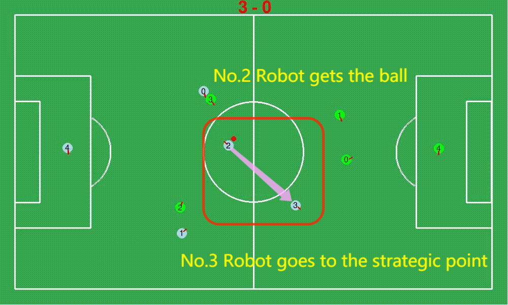
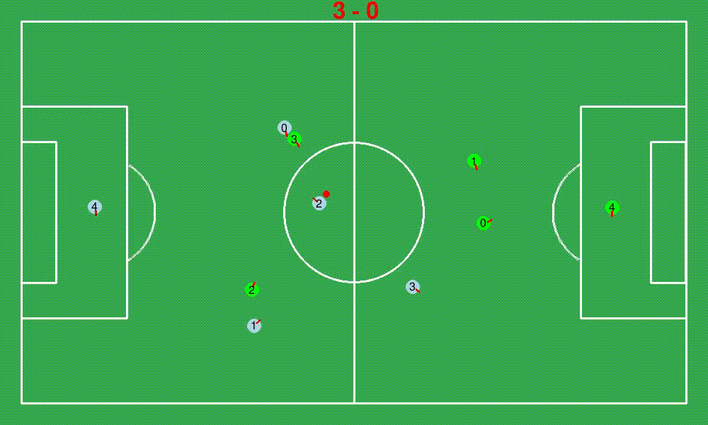

# **Actions**

**[Go back to main page](../../Documentation.md)**

## Go To Strategic Point

Strategic Point is somewhere the robot can cooperate with its teammates effectively. Since ball has three basical status, in our team, in opponent's team, free. Therefore, the strategic point should be changed according to different situations. However, we consider the ball in the opponent's team is more dangerous and urgent.
When the ball is in our team, what we need to do is to make the other attacker which does not have the ball keeps a distance with the robot who gets the ball so that they can pass the ball to each other and score the ball.  
   
### How to do Go To Strategic Point in code?
   
   

      
   

   The process should be 2 main functions
   
   #### The first function：
        boost(robot_state: Position, target: Position)
   This function optimized the parameters, which make the robots run smoothly.
        
   #### The Second function：
        go_to_parametrized(robot_state: Position, target: Position, MIN_PURE_ROTATION_ANGLE, K_P_PURE_ROTATION, MAX_OUTPUT_VALUR, K_P_FORWARD_COMPONENT)
   This function will adjust the velocity according to the parameters, such as State Position and Target Position. 
   
   Go to strategic point will combine this two functions and adjust the velocity of two wheels so that the robot can go to the strategic point quickly and accurately.
   
   Finally, we can see the **No.3** robot in the **Team 0**(Blue one) goes to the strategic point and its teammate No.2 robot gets the ball then they also do pass the ball naturely, which is showed in the Gif below:
   
   

      
   

   
### Shortcomings and future improvements:
   Now we just regard a specific point as the strategic point, and test it by using fixed point relative to the other robot. Although it works in most of cases, yet in some case, it does not make sense to go to that point, for example, when the robot is very closed to the edge of the football field, there is no need for the other one to get that place to cooperate with the robot. So the strategic point should be defined with more parameters and more information.
        

