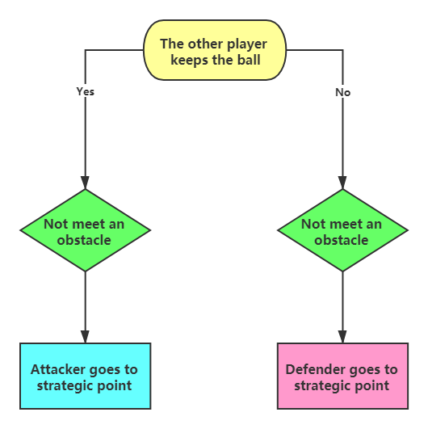

# **Actions**

**[Go back to main page](../../Documentation.md)**

## Strategic Point

We decide to call Strategic Point an estimated position of the optimal location for a robot to cooperate with its teammates effectively and have a good goalscoring position. 
Since the ball has three basic states (in our team, in opponent's team and free) - therefore, a strategic point should be changed according to different situations. 
An example scenario when this function is executed is presented in Figure 1.

<p align="center">
   <br><br>
</p>
__Figure 1__: Visualisation of the strategic point logic
 

### Implementation

The decision process of selecting a strategic point is shown in Figure 2.

<p align="center">
   <br><br>
</p>
__Figure 2__: The algorithm decision process of strategic point function.

The strategic point logic is implemented as a static method ```def go_to_strategic_point(game_info, partner_id)```.

This function adjusts the velocity of both wheels according to the position we set so that the robot can go to the strategic. For example, if one robot holds the ball, the other one will use ***go_to_strategic_point()*** to get a good position to wait for the ball, so they can work with each other effectively.

Based on Figure 3, we can see that **No. 3** robot in the **Team 0** (blue team) goes to the strategic point. When its teammate (player **No. 2**) who has a ball is approached by an opponent he passes the ball to **No. 3** robot which is already waiting at a strategic point.

<p align="center">
   <br><br>
</p>
__Figure 3__: Visualisation of going to the strategic point.


### Limitations:

Now we just regard a specific point as the strategic point and test it by using a fixed point relative to the other robot. 
Although it works in most of the cases, in some scenarios, it does not make sense to go to that point. 
For example, when the robot is very closed to the edge of the football field, there is no need for the other player to get to that place to cooperate with the robot. 

Therefore, the strategic point should be defined with more parameters and more information. It should be more related to the team strategic point, not individual strategic point or the strategic point just for two members.
