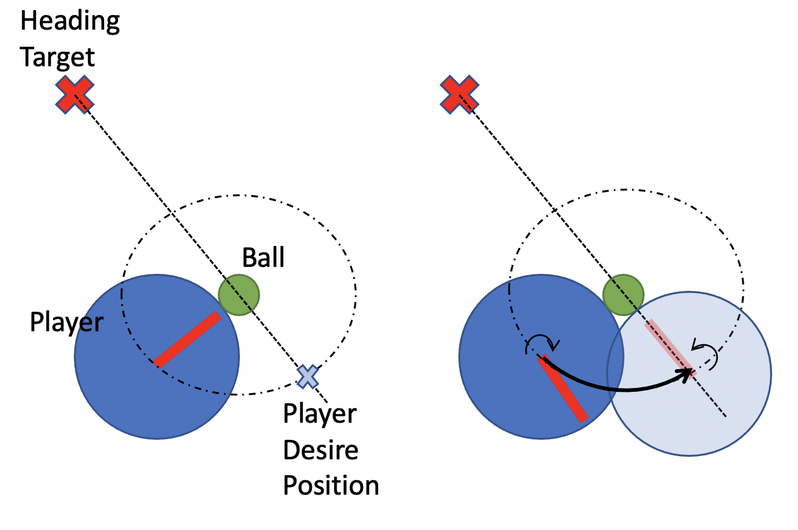
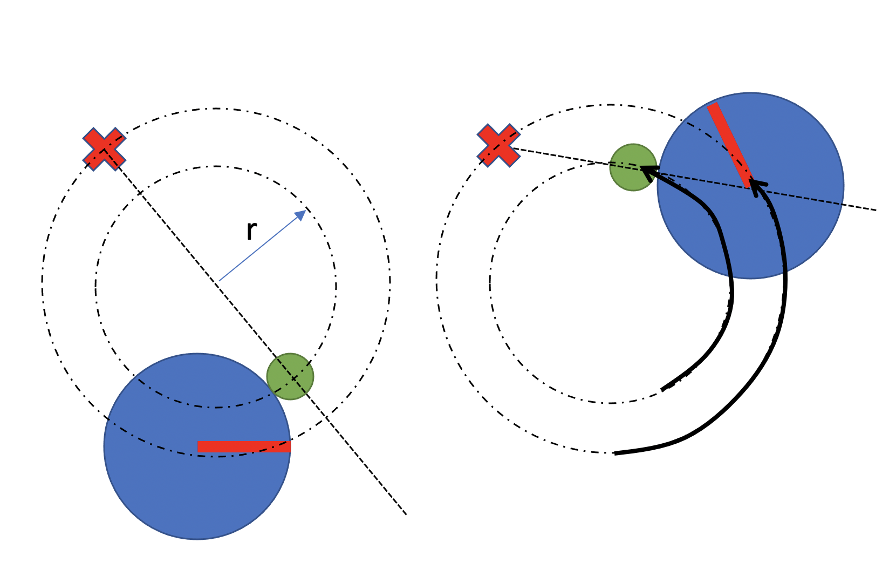

# Strategic action: Redirect the ball 

##### [Go back to main page](../../Documentation.md)

### Application - Strategic actions: 
__Comment!__ Move to the main file

Strategics actions are actions build on top of basic actions (like move to point, rotate, kick the ball).
Those actions create a mid-layer between simple robot control task and high-level planners which takes strategic decisions for a specific robot or the whole team.
Strategic actions, similar to basic actions are reused by all teams and used coherent interfaces to enable easy development and maintenance.

### Redirect the ball
The first and the most basic strategic action is redirect the ball action (called ```move_player_inline_with_ball_and_target()``` in the code).

The goal of this action is to change the relative orientation of the robot with respect to the ball. 
This behaviour is required by most of the other strategic actions.

### Assumptions, Inputs and Outputs
__Assumptions__: The ball is in contact distance from the player.

__Inputs__: Robot state, Ball state, Redirection radius, Target heading

__Output__: Robot control signal

### Logic
The logic behind this function is to move the robot in line with the target, and the ball.

Steps:
* Calculate the robot heading angle (90deg if ball movement radius is 0, 0deg if radius is inf)
* Rotate the robot (using __rotate towards basic function__)  
* Calculate robot movement radius
* While not (robot & target & ball are inline)
    * Move the robot (using __move around the point__)
* Rotate towards the ball (using __rotate towards basic function__)    

The above-mentioned steps are presented graphically in Figure 1 for zero ball radius and Figure 2 for non-zero radius. 


__Figure 1:__ Redirect the ball inplace (r=0)

__Figure 2:__ Redirect the ball for non-zero radius 
