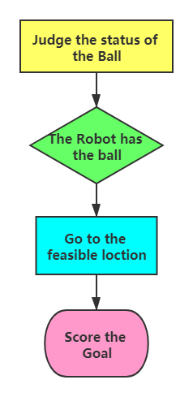

# Strategic action: Score the Goal

##### [Go back to main page](../../Documentation.md)

## Score Goal

Score Goal is one of the most important actions for the robots as it determines which team wins the game. Therefore, effective strategies for goal scoring should be considered carefully. 

   <p align="center">
      <br><br>
   </p>

__Figure 1__: The flow of scoring the goal

As mentioned before, our team adopts the Decision Tree to control all the robots. In the **Decision Tree**, when a robot gets the ball, it needs to judge how far the opponents are from scoring a goal.

What is more, it also needs to check if ```scoring the goal is feasible``` that is mentioned in the supporting functions. This function will return **(x, y) coordinate**, which is the place that robot should kick to. 

We reuse this function here and set the target position to the enemy's goal, thus, passing the ball to the enemy's net is equivalent to scoring the goal.


### Score Goal Implementation
The test case for this function is shown in Figure 2:

   <p align="center">
      <br><br>
   </p>

__Figure 2__: Visualisation of goal scoring.

The process of goal scoring is implemented in three main functions. 

#### 1) Check if a Team Has a Ball

This function returns a flag if any of the team's players are within contact distance to the ball. 
If so, it returns the identifies.

In code, this function is defined with a static method 

```def has_ball(game_info: list)```

The function uses the game information to judge if the robot has the ball and returns a boolean value.
        
#### 2) Check if a Robot Can Score a Goal

This function returns a flag, along with kick coordinates, if a robot with a ball can score a goal with a direct kick. 
It reuses supporting functions to generate points on the net and check for possible collisions with robots along the kick trajectory.

In code, this function is defined with a static method 

```def can_score(game_info: list, team_id) -> (direct_kick_feasible, kick_x, kick_y)```

This function helps to assess whether the recent location is feasible for robots to score a goal. More details are mentioned in the ***can_score()*** .


#### 3) Score the Goal

This function shares the code with _Pass the_Ball_ function. The only difference between discussed functions is that _Score the Goal_ refers to a stationary point on a net rather than another player.

In the code, this function is defined with a static method 

```def score_goal(game_info,kick_x,kick_y) -> command ```

Using the output of the second function (***can_score()***), the robot will ***do score_goal()*** directly if the output is **True** (i.e., the robot is close to the opponent's goal and finds a feasible location to score a goal). The discussed situation is presented in Figure 3:  **No. 3** robot in the **Team 0** (shown in blue) scores the goal.

<p align="center">
   <br><br>
</p>

__Figure 3__: Visualisation of goal scoring.
