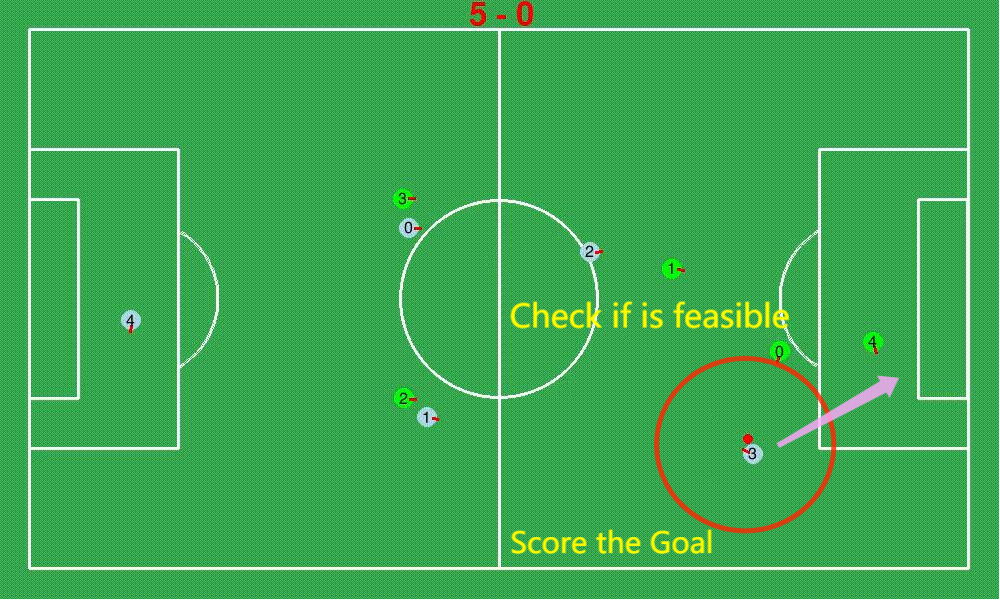
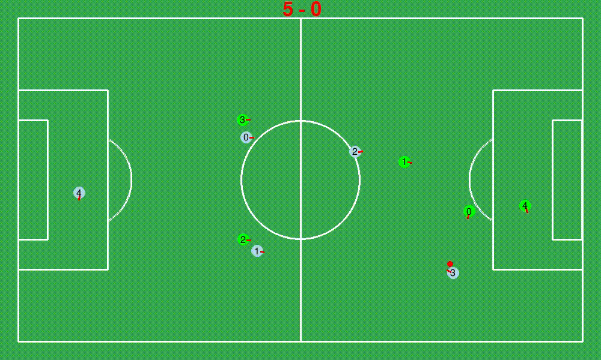

# **Actions**

**[Go back to main page](../../Documentation.md)**

## Score Goal

Score Goal is one of the most strategic important actions for the robots，since it decides which team can win the game directly. Therefore, effective strategies for scoring the Goal should be considered carefully.
As metioned before, our team adopts the Decision Tree to control all the robots logically. In the Deccision Tree, when the robot gets the ball, it needs to judge how far from the enemy's goal. What is more, it also needs to check if [scoring the goal is feasible], which is metioned in the supproting functions. This check function will return (x, y) coordinate, which is the place that robot should do [receive and pass the ball] action in. We reuse this function here and set the target position to the
enemy's goal, thus, passing the ball to the enemy's goal is scoring the goal.
   
### How to do Score Goal in code?
   
   The process should be 3 main functions, the figure of the theory is showed below:
   
   

      
   

   
   #### The first function：
        controller.has_ball(game_info)
   This function uses the game information to judge if the robot has the ball, there are more details in [has_ball].
        
   #### The Second function：
        controller.can_score(game_info, self.team_id)
   This funtion helps to judge whether the recent location is feasible for robots to score goal.
   
   #### The third function：
        controller.score_goal(game_info, kick_x, kick_y)
   Judge from the functions above, if it is ture, which means the robot is close to opponent's goal and find a feasible location to Score the Goal, thus, the robot will score the Goal directly.

   Finally, we can see the **No.3** robot in the **Team 0**(Blue one) scores the goal, which is showed in the Gif below:
   
   

      
   

   
### Shortcomings and future improvements:
   Although the robot can simply judge when and how to score the ball, yet the real physical envirnment is more complex. We should also check if there is opponent near the robot by the limited version. Besides, make the robot able to take actions dymamicly according to the real time situation. Finally, using some deep learning methods, such as BP and CNN should be the other solution to make the robots smart to react to the ball.

        

