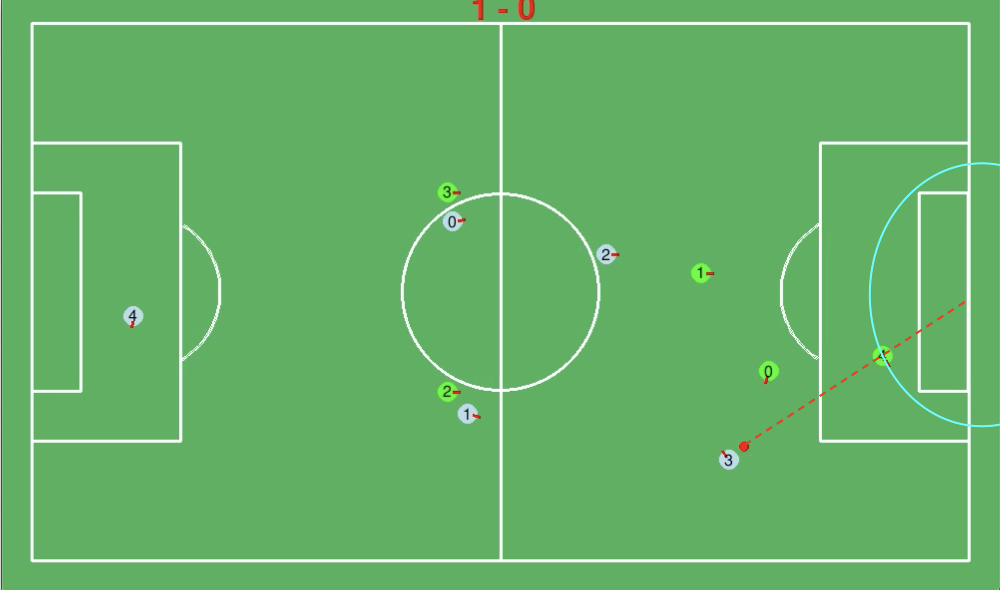
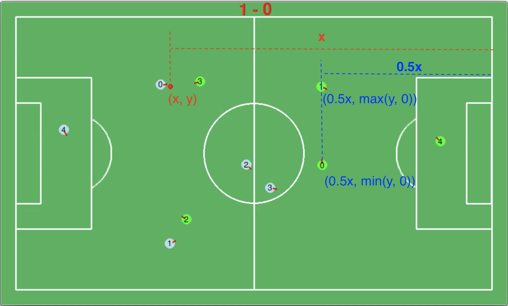
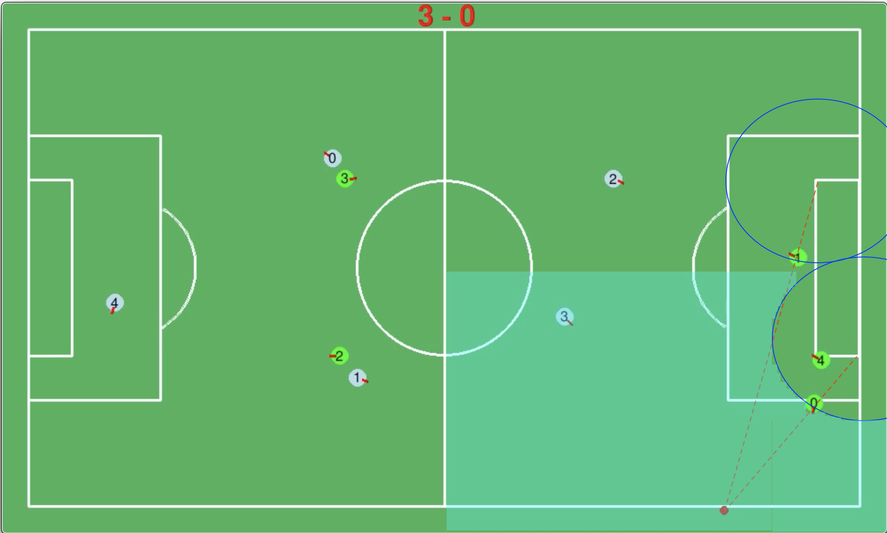
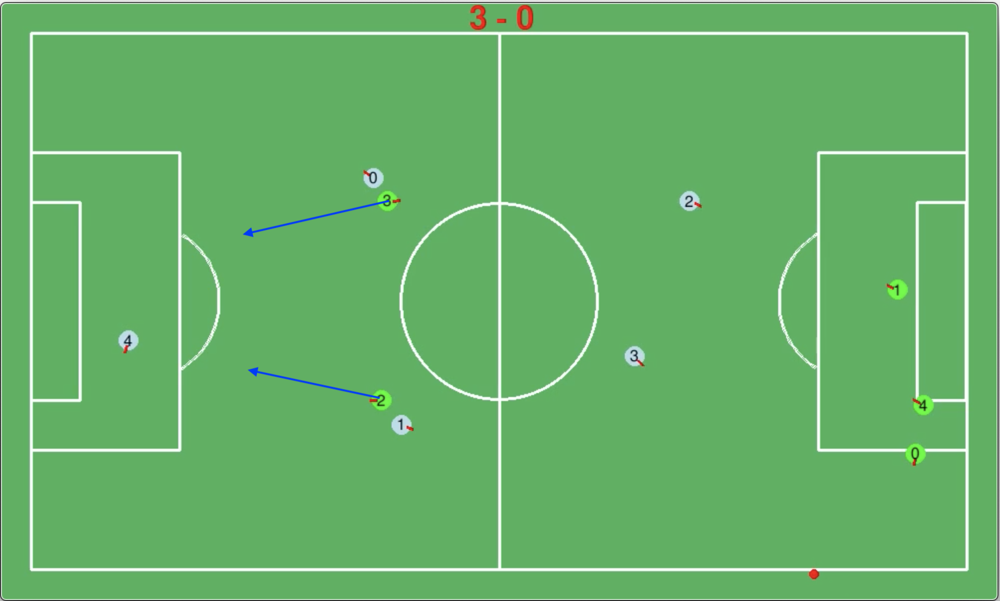

# **Strategy Team 0**

**[Go back to main page](../../Documentation.md)**

## Structure

Each of five robots in the team was given functions: 
1. Two strikers (left and right)
2. Two defenders (left and right)
3. One goalkeeper

Each player has a base logic that is function related. This logic is executed during every iteration.
After each player is assigned the base function, the shared logic search for initiative action. 
If such action is found, the base action is overwritten with initiative action.

__Comment!__ this is Subsumption Architecture (look lecture 6 Robotics foundation)

## Base actions

### Goal Keeper

The goalkeeper operation space is defined as an ellipse with a centre in the middle of the net (Figure 1). 
The robot desire position is defined as the cross point of the ellipse and vector ball to net-mid-point.  

__Figure 1:__ Goalkeeper operation space

### Defenders

Defenders base action depends on the ball distance from the team's net. 
If the ball is in "safe" distance, defenders are a half distance away between the team's net and the ball (Figure 2).
The latitude (y coordinate) of each defender is the same as the ball latitude with a limitation to not move outside its assigned field quarter.

When the ball gets close to the team's net, defenders logic change to not interrupt the goalkeeper and defence the corners of the net.
As shown in Figure 3, the defenders move around the corners and in line with the ball.

Also, in Figure 3, the operation region for the left defender is presented by transparent blue colour. 
The right defender has mirrored along the x-axis zone.

__Figure 2:__ Defenders position when the ball is far from team's net

__Figure 3:__ Defenders position when the ball is close from team's net and left defender operation region.

### Strikers

Strikers have a predefined base position which is a sub-optimal position (Figure 4) to conduct the attack and to receive the ball from defenders.

__Figure 4:__ Strikers base position

## Initiative action

After all, players calculate their base actions, the team master is calculating the closest player to the ball (in the time domain, not in position).
If any player can get to the ball in a shorter or similar time to the fastest opponent, the player is directed to go to the capture point.

If the player is within kick distance, the algorithm checks if a direct goal is possible, or it is able to safely pass the ball to the teammate. 
If any is possible it kicks the ball, otherwise, it moves with the ball towards the opponent's net.    
