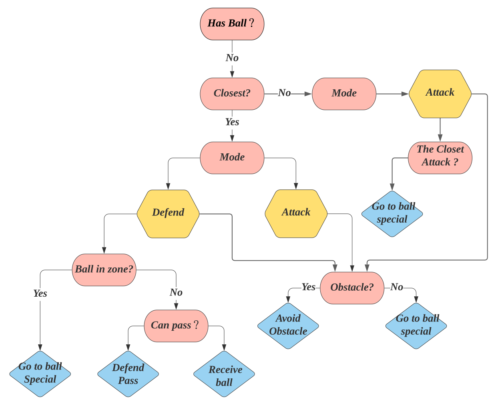

# **Strategy Team 1**

**[Go back to main page](../../Documentation.md)**

## Structure - Decision Tree

The second strategy combines information about both teams and provides actions based on a decision tree. The advantage of this method is its simplicity and interpretability. We can say the tree acts as a coach of the team. It gathers information from the simulator about the team and its opponents and then produces a set of actions for each robot. 

The decision tree structure is split into two main branches. The first branch corresponds to a case when a team has a ball, and the second one to the remaining cases. The diagrams for both branches are presented in Figure 1 and 2. The decision tree prioritises has_ball() output since the team aims to score goals and win a match. 

  

__Figure 1__:  Team 1 decision tree for scenarios in which the team has a ball.

   

     
   

__Figure 2__:  Team 1 decision tree for scenarios in which the team does not have a ball.

The decision tree uses a set of information about the players to discriminate against them, including players id and their corresponding modes. The ids are unique for each player in the game, while the mode can take two states: "DEFEND" or "ATTACK".  This approach ensures that the decision tree accurately assign actions to players. In Figure 3, we show a sample decision tree information flow.

  

__Figure 3__: Sample decision tree information flow.

In addition to the decision tree, every player is commanded by a controller - Player Controller. It receives information about actions from the decision tree and acts upon it. Moreover, the decision tree gets updates from Player Controller (a bi-directional relationship shown in Figure 3). For example, when the decision tree triggers has_ball(), the controller requests information from the simulator to check for the euclidian distance between the ball and the player. If the distance is below a fixed threshold, the method returns True and the flow jumps to the next leaf of the tree.

  

__Figure 4__: An example of the control system used with the decision tree.

Looking at Figure 4 we can say the following:

1. The decision tree queries the controller to check if the player has the ball and returns a boolean value. (In this example the player has the ball).
2. Once the query is done, the tree triggers the controller with a can_score method to check if there are any feasible shooting curves along the way, and the controller returns a boolean.
3. In the given example, the decision tree sends required information for the controller to actuate on the player with an action tuple of (0,0,1). 
The first two parameters are the voltage powers on the left and right wheel respectively, and the last value represents an action to take (in this case 1: KICK).