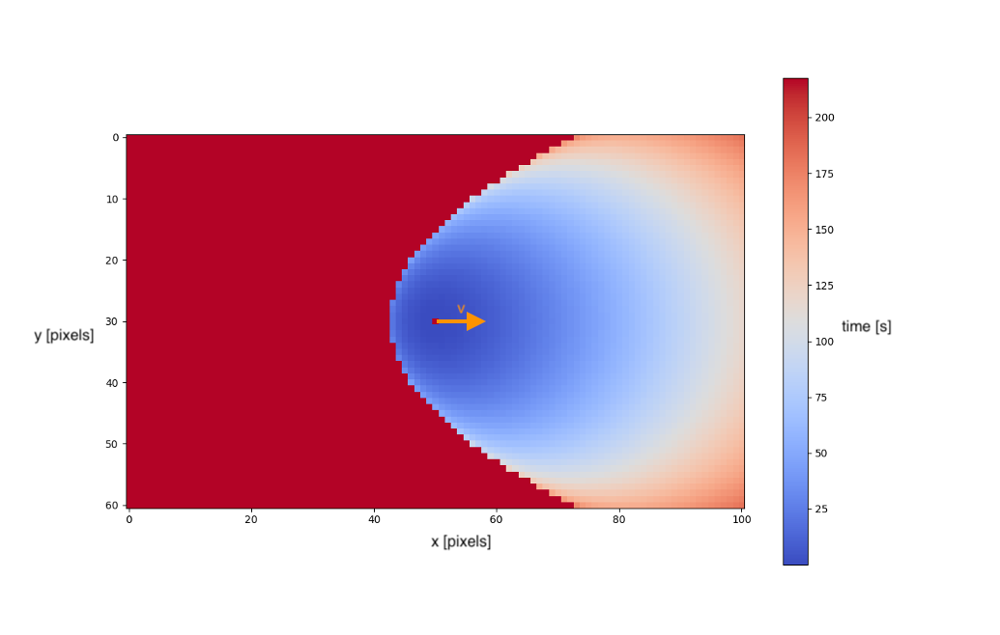
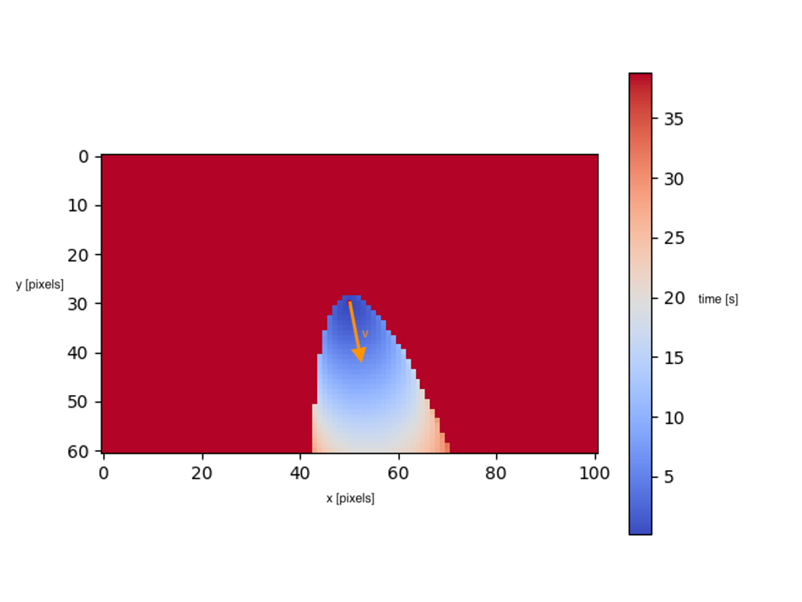

# Supporting functions: Capture the ball: Ball the soonest contact

##### [Go back to main page](../../Documentation.md)


### Ball the soonest contact
The ball the soonest contact function estimates the time when a specific player can get to the freely moving ball (when the robot can cross the ball trajectory).
It takes into consideration the ball state (position and velocity), and robot state (position and max speed). 

If the robot cannot get to the ball before it hits the wall, the function can be configured to take into consideration the ball bounce and calculate intersection time after bounced. 


### Assumptions, Inputs and Outputs
__Assumptions__: The ball is moving with uniform linear motion until it bounces from the field side

__Inputs__: Robot state, Ball state, Field size

__Output__: The soonest time when the robot can intersect the ball trajectory

### Logic

1. Ball trajectory is defined as a time parametric function (straight line: ```x(t) and y(t)```).
2. Robot possible position is defined as a time parametric function (circle: ```radios = max_speed * t```, ```x(t)``` and ```y(t)```)
3. Mentioned equations are solved to find the tangent of ball trajectory (line) to robot possible position (circle)
4. If the time solution is negative or complex:
   * Find trajectory after the ball bounce
   * Go back to point 3
    

The visualisation of time solutions (before the first bounce) are presented in Figure 1 and Figure 2, both with different ball initial velocities.


__Figure 1:__ Time solutions (color) for robots in different initial position (x and y field position) for ball moving with constant velocity (vx > 0, vy = 0) (reduced to solutions found before first bounce).

__Figure 2:__ Time solutions (color) for robots in different initial position (x and y field position) for ball moving with constant velocity (vx > 0, vy < 0) (reduced to solutions found before first bounce).
