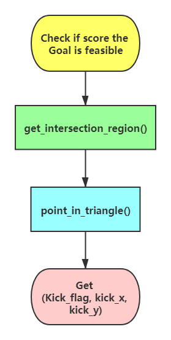

# **Actions**

**[Go back to main page](../../../Documentation.md)**

## Check if Score the Goal is feasible

***check_if_direct_goal_feasible()*** is used by methods related to scoring the gaols. This function returns the flag if the goal can be scored and kick position to maximise the goal changes.

### Implementation
The information flow of this function is presented in Figure 1.

<p align="center">
  <br><br>
</p>
__Figure 1__: The flow of checking if score the Goal is feasible

The main implementation in the code in under a following static method:
```python
def check_if_direct_goal_feasible(player_pos_wcs: Position, ball_pos: Position, opponents_pos_wcs: List[Position], team_id: int, vis: bool = False)
```

This function uses the game information to judge if the direct goal is feasible or not.
The two main information taken into consideration by the function are:
 - distance from net, 
 - dangerous zones, representation of the areas where opponents robot can get before the ball cross the net line.

The described method uses multiple supporting functions to calculate the result. It includes:
1. 
```python
# Estimate the region from where an opponent can capture the ball
# The region is represented by a triangle

@staticmethod
def get_intersection_region(ball_position: np.array, player_position: np.array, kick_slope: float)
```
2.
```python
# This is used to check if an opponent is within the danger zone

@staticmethod
def point_in_triangle(point, t0, t1, t2)
```
