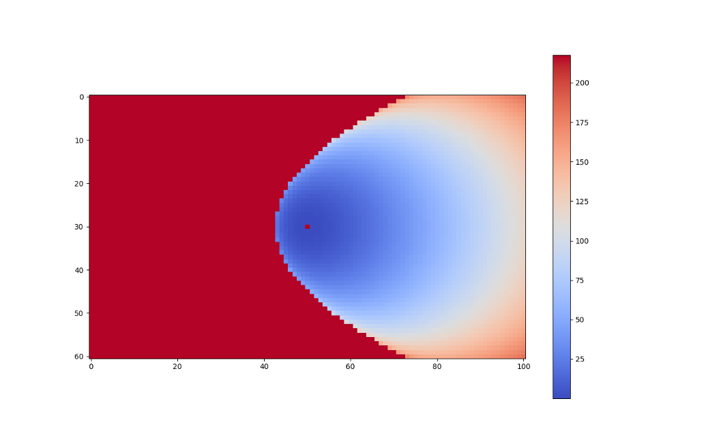

# **Actions**

 **[Go back to main page](../../Documentation.md)**

 ## Player Pass

 Strategy is about planning and deciding the next action to take. 
 One of the most important aspects of strategy is teamwork. 
 Passing is of the main actions to coordinate the team together and generate a good strategy to move the ball in a systematic and coordinated manner.
  Thus, this algorithm focuses on designing passing patterns between the players and ensuring good synchronization between each team member.

 ## How does Player Pass work?

 To generate an efficient passing method, players must process information about the environment and dictate their next action.
  The main question a player asks is whether it can pass the ball or not. Passing the ball follows a careful procedure of checking which players are candidates for a feasible calculated pass.
  The robot posessing the ball processes the following environment information:
   1- Team member positions: The ball holder needs to know all positions of all its teammates in order to decide if to pass and to which target.
   2- Closest team pass candidate: Knowing which player is closest to the enemy's net is important since it can establish a good base for passing the ball and an agressive strategy to enhance the chances of scoring points.
   3- If the candidate is in its strategic point: To keep the movement of the players going, the ball holder waits for its candidate to arrive within a certain threshold of the strategic point and then passes the ball if no opponents are within the area.
   4- Opponents positions: In order to establish whether a pass is feasible or not, the robot needs the opponents' positions in order to check if they might be in the area and trajectory of the ball once passed.
    Consider the following case study:  Player A has the ball and decides on passing since no opponents are around and the closest player to the net Player B is waiting on a pass. 
 This is presented by the following:

  

       
    <figcaption>Figure 1: Pass candidates diagram</figcaption>
    

 Player A's logical action is to pass to Player B based on what is depicted in Figure 1. 
 However, a dangerous opponent might intercept the ball at a given point in time. 
 Since these chances are low, Player A will move on passing the ball to Player B which will further move into the opponents' part of the field.
  Moreover, Player B is chosen as a candidate since it is the closest player to the net, hence all other players are neglected.
  Scoring goals is priotorized since the robots rely on their fast-paced decision making and behavioral control over their actions. 
 Hence, the the robots are going to act aggressively instead of thoroughly planning and taking into account all possibilities.
  Deciding if a pass is feasible is up to the triangles emitted by the player. These triangles contain three straight lines that dictate danger levels. 
 The left-most line poses the most risk. The futher two are medium and least risks respectively. 
  A more detailed representation can be shown in Figure 2:

  

       
    <figcaption>Figure 2: Pass Danger Levels</figcaption>
    

 The above diagram describes the procedure from the player's point of view. 
 This heat map splits the passing trajectories into operational and non-operational workspaces. 
 The latter is colored in red, describing that the player cannot operate and hence pass the ball in this region. 
 The operational workspace is further divided into a set of color maps describing the danger levels of each pass trajectory. 
 The blue zone represents the area that portrays the least risk in passing the ball. and as the area goes farther, the color maps approach the color red as the danger levels approach high risks.

 The following GIF presents all aspects explained into one short animation reinforcing the decisions a player takes once involved in passing:

  

       
    <figcaption>Figure 3: Passing Algorithm Example</figcaption>
    

 This figure demonstrates how player 3 decided to pass to teammate 2 instead of player 1. 
 This checks all expectations from the passing algorithm:

 - [x] Locate teammate that is closest to the opponents' net.
 - [x] Check if pass is feasible using the triangle danger levels.
 - [x] Find optimal player candidate for the pass in terms of moving forward and approaching the enemy's goal post.