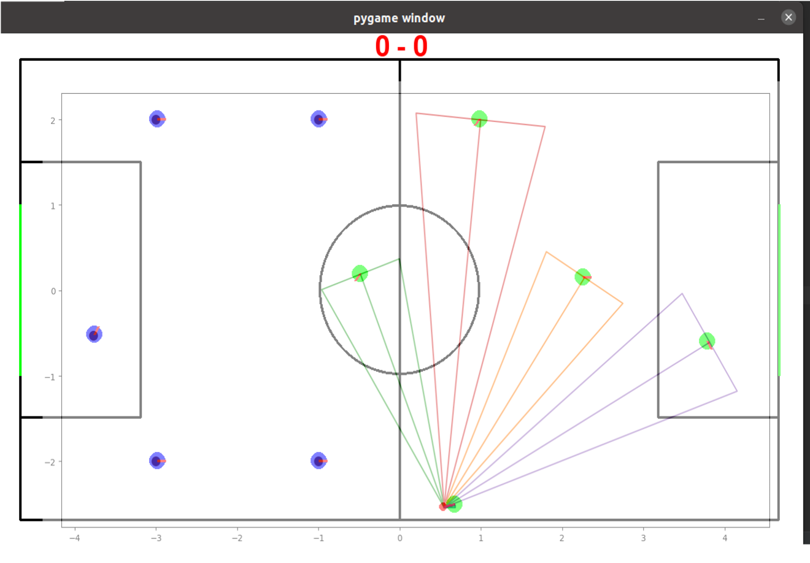
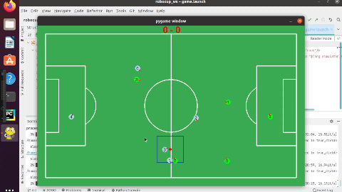

Grammarly sucks my when detecting mistakes, 

# **Actions**

**[Go back to main page](../../../Documentation.md)**

## Player Pass
This algorithm is responsible for finding the best teammate to pass the ball to. 
It calculates if an opponent can capture the passing ball, suggests a player to pass to and provides an interface for "collaboration awareness" used by strategy makers.

 ## Implementation

 To generate an efficient passing method, players must process information about the environment.
 The main problem the algorithm needs to solve is whether it can pass the ball safely. 
 Passing the ball follows a careful procedure of checking which player is a good candidate for a pass.

 In this process the following inputs are needed:
1. Team member positions - the ball holder needs to know all positions of its teammates to decide whether to pass and to which player.
2. Opponent positions - in order to establish whether a pass is feasible or not, the robot needs the opponents' positions to check if they might be in the area and trajectory of the ball.
3. Ball state - information about the ball's position and velocity. 

The algorithm contains three main steps:
1. Check if pass is feasible for all teammates.
2. Calculate teammates pass priority based on their distance from the net.
3. Identify an optimal candidate to pass the ball to.

Consider the following example:
Player A has the ball and decides to pass as there are no opponents around. 
The closest player to the net, Player B, is selected as the best candidate to pass the ball to. 
This is presented in Figure 1:

  

__Figure 1__: Pass candidates diagram.

 Player A's logical action is to pass to Player B based on what is depicted in Figure 1.
 Since there are no opponents in a danger zone, the pass cannot be interrupted. 
 Player B is chosen as a candidate (and all other players are neglected) since player B is the closest player to the net.
 Hence, the robots are going to act aggressively instead of thoroughly planning and taking into account all possibilities.

Deciding if a pass is feasible is based on the triangular shape emitted by players (visible in Figure 1). These triangles contain three straight lines that set danger levels. 

 
Figure 2 shows the full passing sequence. It demonstrates how player 3 decides to pass to teammate 2 instead of player 1. 

     

__Figure 2__: Passing Algorithm Example
